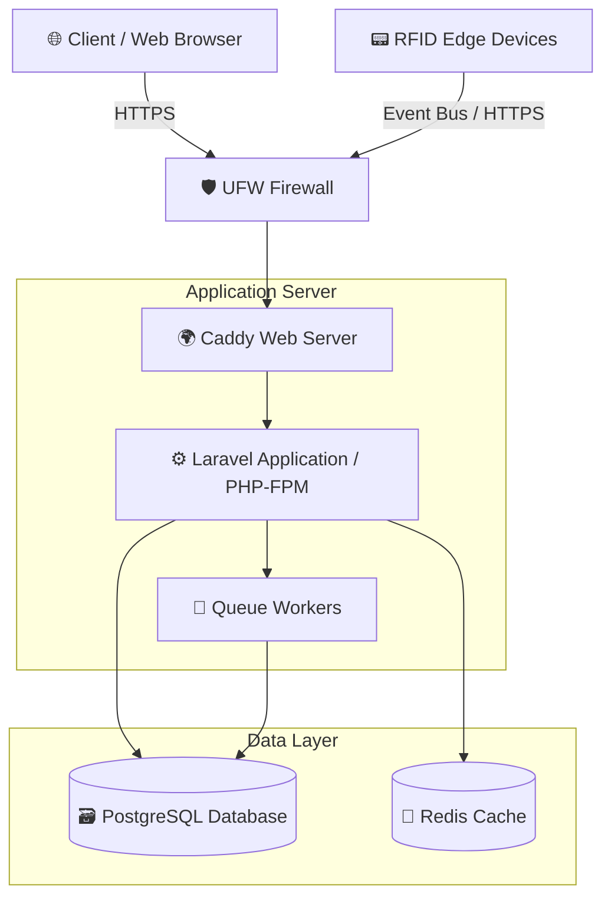

# 🛠️ System Administration & Maintenance Documentation

> **Project:** Cameco HRIS  
> **Document Type:** System Administration & Maintenance  
> **Last Updated:** April 2026  

---

## 📑 Table of Contents
1. [🚀 1. Deployment Plan](#1-deployment-plan)
2. [📊 2. Monitoring Plan](#2-monitoring-plan)
3. [💾 3. Backup & Recovery Plan](#3-backup--recovery-plan)
4. [🔒 4. Security Plan](#4-security-plan)
5. [⚙️ 5. Update & Maintenance Plan](#5-update--maintenance-plan)

---

## 🚀 1. Deployment Plan

This section documents the standard operating procedure for provisioning, installing, and deploying the application (**Cameco HRIS**) to a production environment.

### 💻 Hardware & Software Requirements

**Hardware Recommendations:**

| Component | Minimum Specification | Recommended / Notes |
| :--- | :--- | :--- |
| 🧠 **CPU** | 4 Cores | For managing simultaneous web requests, queues, and RFID processing |
| 🗄️ **RAM** | 8 GB | 16 GB recommended for production workloads |
| 💾 **Storage** | 100 GB SSD | NVMe preferred for database I/O performance |

**Software Requirements:**

| Category | Software | Purpose |
| :--- | :--- | :--- |
| 🐧 **Operating System** | Ubuntu 24.04 LTS | Core server OS (Linux) |
| 🌐 **Web Server** | Caddy or Nginx | Routing HTTP/S traffic (Caddy provides auto-HTTPS) |
| ⚡ **Runtime** | PHP 8.2+ and Node.js 22+ | Application backend and frontend asset compilation |
| 🗃️ **Database** | PostgreSQL 15+ | Main relational database and RFID immutable ledger |
| 🚀 **In-Memory Store** | Redis | Session management, cache, and queueing |

### 🛠️ Installation & Deployment Steps

1.  **Server Provisioning:** Launch a new Ubuntu 24.04 server and apply basic security hardening (create a non-root user, disable root SSH).
2.  **Install Dependencies:**
    ```bash
    sudo apt update
    sudo apt install php8.2-fpm php8.2-pgsql php8.2-redis postgresql redis-server
    ```
3.  **Application Setup:**
    *   Clone the repository into `/var/www/cameco`.
    *   Install PHP dependencies: `composer install --no-dev --optimize-autoloader`.
    *   Install Node.js dependencies: `npm install`.
    *   Copy the production environment variables: `cp .env.production .env`.
4.  **Database & Assets Compilation:**
    *   Run migrations: `php artisan migrate --force`.
    *   Compile frontend assets: `npm run build`.
5.  **Web Server Configuration:**
    *   Configure `Caddyfile` to proxy requests to PHP-FPM and serve static files from the `/public` directory.
    *   Start Caddy to enable the web server and issue SSL certificates automatically.
6.  **Background Workers:** Setup Supervisor to keep `php artisan queue:work` running continuously for background tasks.

### 🕸️ Network Diagram



---

## 📊 2. Monitoring Plan

> *Continuous monitoring ensures system reliability and helps identify bottlenecks before they affect end-users.*

### 📈 Performance Metrics
1.  **Server Uptime & Availability:** Ensuring the application and API endpoints are reachable 99.9% of the time.
2.  **Resource Utilization:** Tracking CPU, RAM, and Disk I/O to prevent out-of-memory errors and maintain snappy response times.
3.  **Application Response Time & Error Rates:** Tracking HTTP 500 errors, database query latencies, and failed queue jobs.

### 🧰 Recommended Tools & Software
*   **Prometheus & Grafana:** For collecting hardware metrics and building visual dashboards for system health.
*   **Sentry / Flare:** For real-time application-level exception tracking and error reporting.
*   **Laravel Horizon:** For monitoring Redis queues, job throughput, and failed jobs.

### 📋 Log Review Frequency
*   🚨 **Daily:** Automated alerts for critical errors (e.g., HTTP 500s or Database connection failures) should be reviewed immediately.
*   📅 **Weekly:** Manual review of Nginx/Caddy access logs, application debug logs, and security audit trails to identify patterns or potential optimization areas.

---

## 💾 3. Backup & Recovery Plan

> *Data integrity is absolutely critical for an HRIS system containing payroll, timekeeping, and attendance records.*

### ⏱️ Backup Schedule
*   **Daily Incremental Backups:** Database transactions and new application uploads are backed up every 12 hours.
*   **Weekly Full Backups:** A complete snapshot of the server environment, database, and all user-uploaded files occurs every Sunday at 2:00 AM.

### 🏢 Backup Storage Location
*   ☁️ **Cloud Storage (Off-site):** Amazon S3 (or equivalent cloud object storage) using restricted IAM policies to ensure data cannot be deleted maliciously (e.g., S3 Object Lock).
*   💽 **Local Secure Drive:** Temporary storage of the last 3 days of backups on a separate mounted volume for rapid restoration.

### 🚑 Recovery Steps (Disaster Recovery)
If a critical failure occurs, the following steps will be executed:
1.  **Damage Assessment:** Identify if the failure is hardware, software, or data-related.
2.  **Server Re-provisioning:** If the server is unrecoverable, spin up a new Ubuntu instance using automated infrastructure scripts.
3.  **Application Restoration:** Clone the application repository and reinstall dependencies.
4.  **Data Restoration:** 
    *   Download the latest stable backup from the Cloud Storage.
    *   Restore the database using: `pg_restore -d hr_database backup_file.sql`.
    *   Restore uploaded files to the `/storage/app/public` directory.
5.  **Verification:** Run internal tests to verify data integrity (especially payroll and timekeeping logs) before updating DNS and re-routing user traffic.

---

## 🔒 4. Security Plan

> *Protecting sensitive employee data and ensuring system integrity against unauthorized access.*

### 🛡️ Security Measures
1.  🔐 **SSL/TLS Encryption:** All data transmitted between the client and the server is encrypted using HTTPS.
2.  🧱 **UFW Firewall & Network Isolation:** The server firewall restricts all incoming traffic except for HTTP (80), HTTPS (443), and SSH (22). Database ports are completely blocked from external access.
3.  🔑 **Role-Based Access Control (RBAC):** Strict permissions are enforced at the code level, ensuring users can only access modules designated for their role.

### 👥 User Roles & Access Rights

| Role | Access Rights / Responsibilities |
| :--- | :--- |
| 👑 **Superadmin** | Full system access. Responsible for system monitoring, server management, and emergency overrides. |
| 🏢 **Office Admin** | Administrative rights for company setup and business rules configuration. No access to sensitive payroll data. |
| 👔 **HR Manager** | Approval rights for workflows (leave, ATS, appraisals) and oversight. |
| 📝 **HR Staff** | Day-to-day data entry, handling employee operations, and managing timekeeping records. |
| 💵 **Payroll Officer** | Access restricted strictly to payroll processing, cash/digital salary distribution, and government remittances. |

### 🚨 Incident Response Procedure
In the event of a suspected security breach or data leak:
1.  🛑 **Containment:** Instantly disable the compromised accounts, enforce a system-wide password reset, and optionally enable maintenance mode to cut off external access.
2.  🔍 **Investigation:** Analyze access logs, database query logs, and the immutable RFID ledger to determine the extent and vector of the breach.
3.  🧹 **Eradication & Patching:** Remove any malicious payloads, revoke compromised SSH keys/tokens, and apply necessary software patches.
4.  📢 **Notification:** Inform affected stakeholders (management and employees) in compliance with local data privacy laws (e.g., Data Privacy Act).
5.  📝 **Post-Mortem:** Document the incident details, response times, and implement new safeguards to prevent recurrence.

---

## ⚙️ 5. Update & Maintenance Plan

> *Routine maintenance is required to patch vulnerabilities, improve performance, and release new features.*

### 🔄 Update Procedures

| Component | Update Procedure & Frequency |
| :--- | :--- |
| 🐧 **Operating System** | Security patches and package updates (`apt upgrade`) are applied monthly. |
| 🗃️ **Database** | Minor version updates applied automatically; major upgrades require a scheduled maintenance window and full backup. |
| ⚙️ **Application** | Deployed via CI/CD pipeline. `php artisan down` is used to safely put the system in maintenance mode during migrations. |

### 👤 Responsibility
*   👨‍💻 **System Administrator / DevOps Engineer:** Responsible for server-level updates, database maintenance, and ensuring automated backups are functional.
*   👨‍💼 **Lead Developer:** Responsible for reviewing application code updates and merging them into the production branch.

### ⏳ Downtime Management
*   📅 **Scheduling:** Scheduled maintenance will be performed during off-peak hours (e.g., Saturday at 11:00 PM).
*   📧 **Communication:** Users will be notified at least 48 hours in advance via an in-app banner alert and email notifications.
*   🎨 **User Experience:** During the update window, visitors will see a branded, friendly "System Under Maintenance" page detailing the expected return time.
