# SyncingSteel System - User Workflow Flowchart

## Overview
This document provides detailed workflow flowcharts for all user roles in the SyncingSteel System, an **on-premise HRIS** deployed on company servers for internal use by office staff.

## System Architecture
- **Deployment**: On-premise, deployed on company server
- **Access**: Internal use by office staff only
- **External Input**: Supervisors submit paper records; employees submit leave requests (no system access)
- **Integration**: RFID timekeeping → Event bus → Payroll, Timekeeping, Notifications
- **Future Plans**: Public job board, bank transfer/e-wallet payment support

## User Roles & Responsibilities

### 1. Superadmin
**Responsibilities**: System and application monitoring, setup, and maintenance
- System health monitoring and observability
- Application configuration and deployment
- Server management and security
- System-level logs and metrics
- User account management (create/invite users)
- Full access to all modules for emergency operations

### 2. Office Admin
**Responsibilities**: Company setup, business rules, and process configuration
- Company onboarding and initial setup
- Business rules and process configuration
- Leave policies and approval workflows
- Salary structures and payroll rules
- Department and position management
- System-wide configurations (payment methods, government rates)
- Approval authority for major employee requests (based on configuration)

### 3. HR Manager
**Responsibilities**: Oversees HR operations and approves critical HR processes
- Approve leave requests (based on configuration: auto-approve short leaves or require manager approval)
- Approve hiring decisions and job offers
- Approve performance appraisals and ratings
- Approve employee terminations and transfers
- Review and approve workforce schedules
- Oversee HR staff operations

### 4. HR Staff
**Responsibilities**: Day-to-day HR operations and data entry
- Input leave requests submitted by employees (paper/email)
- Input workforce assignments submitted by supervisors (paper records)
- Manage ATS: Job postings, applications, interviews
- Process employee onboarding after hiring
- Manage employee records and documentation
- Generate HR reports
- Coordinate timekeeping and attendance

### 5. Payroll Officer
**Responsibilities**: All payroll-related operations
- Process payroll periods and calculations
- Manage salary components and deductions
- Handle employee advances and loans
- Process government remittances (SSS, PhilHealth, Pag-IBIG, BIR)
- Generate payslips and payment files
- Manage cash distribution (current method)
- Generate payroll reports and analytics

---


## Complete System Workflow Overview


---

## Superadmin Workflow

### Core Responsibilities: System Monitoring, Setup & Maintenance


---

## Office Admin Workflow

### Core Responsibilities: Company Setup, Business Rules & Process Configuration


---
    
    %% User Management
    ManageUsers --> ReviewReg[Review Registrations]
    ReviewReg --> ApproveUser{Approve User?}
    ApproveUser -->|Yes| ActivateUser[Activate User Account]
    ApproveUser -->|No| RejectUser[Reject Registration]
    ActivateUser --> LinkToEmployee{Link to Employee?}
    LinkToEmployee -->|Yes| SearchEmployee[Search Employee Record]
    LinkToEmployee -->|No| CreateEmployee[Create New Employee]
    SearchEmployee --> Link[Link User-Employee]
    CreateEmployee --> Link
    Link --> UserManagementEnd([User Setup Complete])
    RejectUser --> UserManagementEnd
    
    %% Employee Management
    ManageEmployees --> EmployeeActions{Select Action}
    EmployeeActions --> ViewEmployees[View All Employees]
    EmployeeActions --> AddEmployee[Add New Employee]
    EmployeeActions --> EditEmployee[Edit Employee]
    EmployeeActions --> DeleteEmployee[Archive Employee]
    
    AddEmployee --> EmployeeForm[Fill Employee Form]
    EmployeeForm --> PersonalInfo[Personal Information]
    PersonalInfo --> EmploymentInfo[Employment Details]
    EmploymentInfo --> GovtIDs[Government IDs]
    GovtIDs --> FamilyInfo[Family Information]
    FamilyInfo --> SaveEmployee[Save Employee Record]
    SaveEmployee --> GenerateContract[Generate Employment Contract]
    GenerateContract --> EmployeeEnd([Employee Created])
    
    ViewEmployees --> EmployeeEnd
    EditEmployee --> EmployeeForm
    DeleteEmployee --> ConfirmDelete{Confirm Delete?}
    ConfirmDelete -->|Yes| SoftDelete[Soft Delete Record]
    ConfirmDelete -->|No| EmployeeEnd
    SoftDelete --> EmployeeEnd
    
    %% Timekeeping Management
    ManageTimekeeping --> TimekeepingActions{Select Action}
    TimekeepingActions --> ViewAttendance[View Attendance]
    TimekeepingActions --> ManualEntry[Manual Time Entry]
    TimekeepingActions --> ImportTimesheet[Import Timesheet]
    TimekeepingActions --> ManageSchedules[Manage Work Schedules]
    
    ManualEntry --> SelectEmployee1[Select Employee]
    SelectEmployee1 --> RecordTime[Record Time In/Out]
    RecordTime --> TimekeepingEnd([Time Recorded])
    
    ImportTimesheet --> UploadFile[Upload CSV/Excel]
    UploadFile --> ValidateData[Validate Import Data]
    ValidateData --> ImportSuccess{Valid Data?}
    ImportSuccess -->|Yes| ProcessImport[Process Import]
    ImportSuccess -->|No| ShowErrors[Show Validation Errors]
    ShowErrors --> FixErrors[Fix Data Issues]
    FixErrors --> UploadFile
    ProcessImport --> TimekeepingEnd
    
    ViewAttendance --> TimekeepingEnd
    ManageSchedules --> TimekeepingEnd
    
    %% Payroll Management
    ManagePayroll --> PayrollActions{Select Action}
    PayrollActions --> ViewPayroll[View Payroll Records]
    PayrollActions --> ProcessPayroll[Process Payroll Period]
    PayrollActions --> ManageSalary[Manage Salary Components]
    PayrollActions --> GeneratePayslips[Generate Payslips]
    
    ProcessPayroll --> CreatePeriod[Create Payroll Period]
    CreatePeriod --> FetchAttendance[Fetch Attendance Data]
    FetchAttendance --> CalculateSalary[Calculate Salaries]
    CalculateSalary --> ApplyDeductions[Apply Deductions]
    ApplyDeductions --> CalculateTax[Calculate Taxes]
    CalculateTax --> ReviewPayroll{Review & Approve?}
    ReviewPayroll -->|Approve| FinalizePayroll[Finalize Payroll]
    ReviewPayroll -->|Reject| AdjustPayroll[Make Adjustments]
    AdjustPayroll --> CalculateSalary
    FinalizePayroll --> PayrollEnd([Payroll Processed])
    
    ViewPayroll --> PayrollEnd
    ManageSalary --> PayrollEnd
    GeneratePayslips --> PayrollEnd
    
    %% Reports
    ManageReports --> ReportType{Select Report Type}
    ReportType --> PayrollReport[Payroll Reports]
    ReportType --> AttendanceReport[Attendance Reports]
    ReportType --> EmployeeReport[Employee Reports]
    ReportType --> FinancialReport[Financial Reports]
    
    PayrollReport --> SelectPeriod[Select Period]
    AttendanceReport --> SelectPeriod
    EmployeeReport --> SelectPeriod
    FinancialReport --> SelectPeriod
    
    SelectPeriod --> GenerateReport[Generate Report]
    GenerateReport --> ExportFormat{Export Format}
    ExportFormat --> ExportPDF[Export as PDF]
    ExportFormat --> ExportExcel[Export as Excel]
    ExportPDF --> ReportEnd([Report Generated])
    ExportExcel --> ReportEnd
    
    %% Visitors Management
    ManageVisitors --> VisitorActions{Select Action}
    VisitorActions --> RegisterVisitor[Register New Visitor]
    VisitorActions --> CheckInOut[Check In/Out Visitor]
    VisitorActions --> ViewVisitorLog[View Visitor Log]
    
    RegisterVisitor --> VisitorForm[Fill Visitor Form]
    VisitorForm --> AssignBadge[Assign Badge Number]
    AssignBadge --> NotifyHost[Notify Host Employee]
    NotifyHost --> VisitorEnd([Visitor Registered])
    
    CheckInOut --> VisitorEnd
    ViewVisitorLog --> VisitorEnd
    
    %% Performance Management
    ManagePerformance --> PerformanceActions{Select Action}
    PerformanceActions --> CreateReview[Create Performance Review]
    PerformanceActions --> ViewReviews[View All Reviews]
    PerformanceActions --> ScheduleReview[Schedule Review]
    
    CreateReview --> SelectEmployee2[Select Employee]
    SelectEmployee2 --> ReviewForm[Fill Review Form]
    ReviewForm --> RatePerformance[Rate Performance Criteria]
    RatePerformance --> AddComments[Add Comments & Feedback]
    AddComments --> SubmitReview[Submit Review]
    SubmitReview --> PerformanceEnd([Review Completed])
    
    ViewReviews --> PerformanceEnd
    ScheduleReview --> PerformanceEnd

```

---

## HR Manager Workflow

### Core Responsibilities: Oversee HR Operations & Approve Critical Processes


---

## HR Staff Workflow

### Core Responsibilities: Day-to-Day HR Operations & Data Entry

```mermaid
graph TD
    HRLogin([HR Staff Login]) --> HRDash[HR Staff Dashboard]
    
    HRDash --> EmployeeMgmt[Employee Management]
    HRDash --> LeaveInput[Leave Request Input From Employees]
    HRDash --> WorkforceInput[Workforce Management Input From Supervisors]
    HRDash --> ATSModule[Applicant Tracking System ATS]
    HRDash --> OnboardingModule[Employee Onboarding]
    HRDash --> TimekeepingModule[Timekeeping & Attendance]
    HRDash --> AppraisalModule[Performance Appraisal]
    HRDash --> ReportsModule[Reports & Analytics]
    
    %% 1. Employee Management
    EmployeeMgmt --> ViewEmployees[View All Employees]
    EmployeeMgmt --> AddEmployee[Add New Employee]
    EmployeeMgmt --> EditEmployee[Edit Employee Info]
    EmployeeMgmt --> ManageDocuments[Manage Employee Documents]
    
    ViewEmployees --> FilterEmployees{Filter Employees}
    FilterEmployees -->|By Department| DeptFilter[Show by Department]
    FilterEmployees -->|By Status| StatusFilter[Active/Inactive/On Leave]
    FilterEmployees -->|By Position| PositionFilter[Show by Position]
    DeptFilter --> EmployeeList[Display Employee List]
    StatusFilter --> EmployeeList
    PositionFilter --> EmployeeList
    EmployeeList --> EmployeeEnd1([View Complete])
    
    AddEmployee --> EmployeeForm[Fill Employee Form]
    EmployeeForm --> PersonalInfo[Personal Information]
    PersonalInfo --> ContactInfo[Contact Details]
    ContactInfo --> EmergencyContacts[Emergency Contacts]
    EmergencyContacts --> GovtIDs[Government IDs SSS PhilHealth Pag-IBIG TIN]
    GovtIDs --> EmploymentDetails[Employment Details]
    EmploymentDetails --> SalaryInfo[Salary Information]
    SalaryInfo --> SaveEmployee[Save Employee Record]
    SaveEmployee --> GenerateDocs[Generate Employee Documents]
    GenerateDocs --> EmployeeEnd2([Employee Created])
    
    EditEmployee --> SelectEmployee[Select Employee to Edit]
    SelectEmployee --> UpdateForm[Update Information]
    UpdateForm --> SaveChanges[Save Changes]
    SaveChanges --> LogChanges[Log Audit Trail]
    LogChanges --> EmployeeEnd3([Employee Updated])
    
    ManageDocuments --> SelectEmployeeDoc[Select Employee]
    SelectEmployeeDoc --> DocActions{Select Action}
    DocActions --> UploadDoc[Upload Document]
    DocActions --> GenerateDoc[Generate Document]
    DocActions --> ViewDoc[View Documents]
    DocActions --> DownloadDoc[Download Document]
    UploadDoc --> DocEnd([Document Managed])
    GenerateDoc --> DocEnd
    ViewDoc --> DocEnd
    DownloadDoc --> DocEnd
    
    %% 2. Leave Request Input From Employees
    LeaveInput --> LeaveSource{Leave Request Source}
    LeaveSource -->|Paper Form| ScanPaperForm[Scan/Input Paper Form]
    LeaveSource -->|Email| ReadEmail[Read Email Request]
    LeaveSource -->|Phone| TakePhoneRequest[Take Phone Request]
    
    ScanPaperForm --> InputLeaveDetails[Input Leave Details into System]
    ReadEmail --> InputLeaveDetails
    TakePhoneRequest --> InputLeaveDetails
    
    InputLeaveDetails --> SelectEmployeeLeave[Select Employee]
    SelectEmployeeLeave --> SelectLeaveType[Select Leave Type]
    SelectLeaveType --> SelectDates[Select Start/End Dates]
    SelectDates --> EnterReason[Enter Leave Reason]
    EnterReason --> CheckLeaveBalance[Check Leave Balance]
    CheckLeaveBalance --> BalanceSufficient{Balance Sufficient?}
    BalanceSufficient -->|Yes| ProceedLeave[Proceed with Request]
    BalanceSufficient -->|No| InformEmployee[Inform Employee Insufficient Balance]
    ProceedLeave --> CheckDuration{Check Duration}
    CheckDuration -->|1-2 days| AutoApproveLeave[System Auto-Approves]
    CheckDuration -->|3-5 days| SubmitForManager[Submit to HR Manager]
    CheckDuration -->|6+ days| SubmitForBoth[Submit to HR Manager + Office Admin]
    AutoApproveLeave --> NotifyEmployee[Notify Employee]
    SubmitForManager --> NotifyEmployee
    SubmitForBoth --> NotifyEmployee
    NotifyEmployee --> LeaveEnd([Leave Request Submitted])
    InformEmployee --> LeaveEnd
    
    %% 3. Workforce Management Input From Supervisors
    WorkforceInput --> WorkforceSource{Input Source}
    WorkforceSource -->|Paper Schedule| ScanSchedule[Scan Paper Schedule]
    WorkforceSource -->|Supervisor Notes| InputNotes[Input Supervisor Notes]
    
    ScanSchedule --> InputWorkforceData[Input Workforce Data]
    InputNotes --> InputWorkforceData
    
    InputWorkforceData --> ManageRotations[Manage Rotation Patterns]
    InputWorkforceData --> ManageSchedules[Manage Work Schedules]
    InputWorkforceData --> ManageAssignments[Manage Daily Assignments]
    
    ManageRotations --> CreateRotation[Create Rotation Pattern]
    CreateRotation --> RotationForm[Fill Rotation Form]
    RotationForm --> RotationType[Select Type: 4x2 5x2 6x1 etc]
    RotationType --> SaveRotation[Save Rotation]
    SaveRotation --> WorkforceEnd1([Rotation Created])
    
    ManageSchedules --> CreateSchedule[Create Schedule]
    CreateSchedule --> ScheduleForm[Fill Schedule Form]
    ScheduleForm --> ScheduleType[Select Type: Regular Fixed Shift]
    ScheduleType --> SetScheduleHours[Set Working Hours]
    SetScheduleHours --> SaveSchedule[Save Schedule]
    SaveSchedule --> WorkforceEnd2([Schedule Created])
    
    ManageAssignments --> BulkAssign[Bulk Assign Employees]
    ManageAssignments --> IndividualAssign[Individual Assignment]
    BulkAssign --> SelectEmployees[Select Multiple Employees]
    SelectEmployees --> SelectRotationSchedule[Select Rotation + Schedule]
    SelectRotationSchedule --> SelectDateRange[Select Date Range]
    SelectDateRange --> CheckConflicts[Check for Conflicts]
    CheckConflicts --> ConflictsFound{Conflicts Found?}
    ConflictsFound -->|Yes| ShowConflicts[Show Conflict Details]
    ConflictsFound -->|No| GenerateAssignments[Generate Assignments]
    ShowConflicts --> ResolveConflicts{Resolve?}
    ResolveConflicts -->|Adjust| AdjustAssignments[Adjust Assignments]
    ResolveConflicts -->|Override| OverrideConflicts[Override and Proceed]
    AdjustAssignments --> CheckConflicts
    OverrideConflicts --> GenerateAssignments
    GenerateAssignments --> SaveAssignments[Save Assignments]
    SaveAssignments --> NotifySupervisor[Notify Supervisor]
    NotifySupervisor --> WorkforceEnd3([Assignments Created])
    
    IndividualAssign --> SelectOneEmployee[Select Employee]
    SelectOneEmployee --> SelectDate[Select Date]
    SelectDate --> SelectShift[Select Shift]
    SelectShift --> SaveIndividual[Save Assignment]
    SaveIndividual --> WorkforceEnd3
    
    %% 4. Applicant Tracking System ATS
    ATSModule --> ManageJobPostings[Manage Job Postings]
    ATSModule --> ManageApplications[Manage Applications]
    ATSModule --> ManageInterviews[Manage Interviews]
    ATSModule --> ManagePipeline[Manage Hiring Pipeline]
    
    ManageJobPostings --> CreateJobPosting[Create Job Posting]
    CreateJobPosting --> JobPostingForm[Fill Job Posting Form]
    JobPostingForm --> JobTitle[Job Title, Description]
    JobTitle --> Requirements[Requirements, Qualifications]
    Requirements --> SalaryRange[Salary Range]
    SalaryRange --> PostingChannels[Select Posting Channels]
    PostingChannels --> FacebookPosting[Facebook]
    PostingChannels --> InPersonPosting[In-Person Office]
    PostingChannels --> FutureJobBoard[Future: Public Job Board]
    FacebookPosting --> PublishJob[Publish Job Posting]
    InPersonPosting --> PublishJob
    FutureJobBoard --> PublishJob
    PublishJob --> ATSEnd1([Job Posted])
    
    ManageApplications --> ApplicationSource{Application Source}
    ApplicationSource -->|Facebook| InputFacebookApp[Input Facebook Application]
    ApplicationSource -->|In-Person| InputInPersonApp[Input In-Person Application]
    ApplicationSource -->|Future Job Board| ImportJobBoardApp[Import from Job Board]
    
    InputFacebookApp --> CreateApplication[Create Application Record]
    InputInPersonApp --> CreateApplication
    ImportJobBoardApp --> CreateApplication
    
    CreateApplication --> CandidateForm[Fill Candidate Form]
    CandidateForm --> CandidateName[Name, Contact Details]
    CandidateName --> UploadResume[Upload Resume]
    UploadResume --> SelectPosition[Select Applied Position]
    SelectPosition --> InitialScreening[Initial Screening]
    InitialScreening --> ScreeningDecision{Screen Result}
    ScreeningDecision -->|Pass| MoveToInterview[Move to Interview Stage]
    ScreeningDecision -->|Reject| RejectApplication[Reject Application]
    MoveToInterview --> ATSEnd2([Application Processed])
    RejectApplication --> SendRejectionEmail[Send Rejection Email]
    SendRejectionEmail --> ATSEnd2
    
    ManageInterviews --> ScheduleInterview[Schedule Interview]
    ScheduleInterview --> SelectCandidate[Select Candidate]
    SelectCandidate --> SelectInterviewer[Select Interviewer]
    SelectInterviewer --> SelectDateTime[Select Date/Time]
    SelectDateTime --> SendInvitation[Send Interview Invitation]
    SendInvitation --> RegisterAsVisitor[Register Candidate as Visitor]
    RegisterAsVisitor --> ATSEnd3([Interview Scheduled])
    
    ManagePipeline --> ViewPipeline[View Hiring Pipeline]
    ViewPipeline --> PipelineStage{Select Stage}
    PipelineStage --> AppliedStage[Applied]
    PipelineStage --> ScreeningStage[Screening]
    PipelineStage --> InterviewStage[Interview]
    PipelineStage --> OfferStage[Offer]
    PipelineStage --> HiredStage[Hired]
    AppliedStage --> ViewCandidates[View Candidates in Stage]
    ScreeningStage --> ViewCandidates
    InterviewStage --> ViewCandidates
    OfferStage --> ViewCandidates
    HiredStage --> ViewCandidates
    ViewCandidates --> ATSEnd4([Pipeline Viewed])
    
    %% 5. Employee Onboarding
    OnboardingModule --> StartOnboarding[Start Onboarding Process]
    StartOnboarding --> SelectNewHire[Select Newly Hired Employee]
    SelectNewHire --> CreateChecklist[Create Onboarding Checklist]
    CreateChecklist --> DocumentCollection[Document Collection]
    DocumentCollection --> NBI[NBI Clearance]
    DocumentCollection --> Medical[Medical Certificate]
    DocumentCollection --> IDCopies[Valid ID Copies]
    DocumentCollection --> BirthCert[Birth Certificate]
    NBI --> CheckDocument{Document Complete?}
    Medical --> CheckDocument
    IDCopies --> CheckDocument
    BirthCert --> CheckDocument
    CheckDocument -->|Yes| AccountProvisioning[Account Provisioning]
    CheckDocument -->|No| FollowUpDocs[Follow-up Missing Documents]
    FollowUpDocs --> DocumentCollection
    
    AccountProvisioning --> CreateUserAccount[Create User Account]
    AccountProvisioning --> AssignRFID[Assign RFID Card]
    AccountProvisioning --> EnrollBiometrics[Enroll Biometrics Future]
    CreateUserAccount --> SendCredentials[Send Login Credentials]
    AssignRFID --> SendCredentials
    EnrollBiometrics --> SendCredentials
    SendCredentials --> OrientationSchedule[Schedule Orientation]
    OrientationSchedule --> CompanyOrientation[Company Orientation]
    CompanyOrientation --> DepartmentOrientation[Department Orientation]
    DepartmentOrientation --> SystemTraining[System Training]
    SystemTraining --> CompleteOnboarding[Complete Onboarding]
    CompleteOnboarding --> ActivateEmployee[Activate Employee in Payroll]
    ActivateEmployee --> OnboardingEnd([Onboarding Complete])
    
    %% 6. Timekeeping & Attendance
    TimekeepingModule --> ViewAttendance[View Attendance Records]
    TimekeepingModule --> ManualEntry[Manual Time Entry]
    TimekeepingModule --> ImportRecords[Import RFID Records]
    TimekeepingModule --> GenerateSummary[Generate Attendance Summary]
    
    ViewAttendance --> SelectPeriod[Select Period]
    SelectPeriod --> SelectDepartment[Select Department]
    SelectDepartment --> DisplayAttendance[Display Attendance]
    DisplayAttendance --> TimekeepingEnd1([Attendance Viewed])
    
    ManualEntry --> SelectEmployeeTime[Select Employee]
    SelectEmployeeTime --> EnterTimeIn[Enter Time In]
    EnterTimeIn --> EnterTimeOut[Enter Time Out]
    EnterTimeOut --> EnterDate[Enter Date]
    EnterDate --> Reason[Enter Reason for Manual Entry]
    Reason --> SaveTimeEntry[Save Time Entry]
    SaveTimeEntry --> TimekeepingEnd2([Manual Entry Saved])
    
    ImportRecords --> RFIDEvent[RFID Card Tap Event]
    RFIDEvent --> EdgeDevice[RFID Edge Device]
    EdgeDevice --> AtomicEvent[Generate Atomic Event]
    AtomicEvent --> EventBus[Internal Event Bus]
    EventBus --> TimekeepingConsumer[Timekeeping Consumer]
    EventBus --> PayrollConsumer[Payroll Consumer]
    EventBus --> NotificationConsumer[Notification Consumer]
    TimekeepingConsumer --> ProcessTimeRecord[Process Time Record]
    PayrollConsumer --> UpdatePayrollData[Update Payroll Data]
    NotificationConsumer --> SendNotification[Send Notification]
    ProcessTimeRecord --> ValidateRecord[Validate Time Record]
    ValidateRecord --> ValidRecord{Valid?}
    ValidRecord -->|Yes| SaveRecord[Save to Database]
    ValidRecord -->|No| FlagForReview[Flag for HR Review]
    SaveRecord --> TimekeepingEnd3([Record Imported])
    FlagForReview --> TimekeepingEnd3
    
    GenerateSummary --> SelectPeriodSummary[Select Period]
    SelectPeriodSummary --> CalculateTotals[Calculate Total Hours]
    CalculateTotals --> CalculateLates[Calculate Lates/Undertimes]
    CalculateLates --> CalculateAbsences[Calculate Absences]
    CalculateAbsences --> CalculateOT[Calculate Overtime]
    CalculateOT --> GenerateSummaryReport[Generate Summary Report]
    GenerateSummaryReport --> SendToPayroll[Send to Payroll Module]
    SendToPayroll --> TimekeepingEnd4([Summary Generated])
    
    %% 7. Performance Appraisal
    AppraisalModule --> CreateAppraisal[Create Performance Appraisal]
    AppraisalModule --> ViewAppraisals[View All Appraisals]
    AppraisalModule --> ScheduleReview[Schedule Review Cycle]
    
    CreateAppraisal --> SelectEmployeeAppraisal[Select Employee]
    SelectEmployeeAppraisal --> SelectReviewPeriod[Select Review Period]
    SelectReviewPeriod --> AppraisalForm[Fill Appraisal Form]
    AppraisalForm --> RateCompetencies[Rate Competencies]
    RateCompetencies --> RateGoals[Rate Goal Achievement]
    RateGoals --> AddComments[Add Comments]
    AddComments --> CalculateScore[Calculate Overall Score]
    CalculateScore --> SubmitForApproval[Submit to HR Manager]
    SubmitForApproval --> AppraisalEnd1([Appraisal Created])
    
    ViewAppraisals --> FilterAppraisals[Filter by Department/Status]
    FilterAppraisals --> AppraisalEnd2([Appraisals Viewed])
    
    ScheduleReview --> SelectReviewCycle[Select Review Cycle]
    SelectReviewCycle --> SelectEmployeesForReview[Select Employees]
    SelectEmployeesForReview --> SetDeadline[Set Review Deadline]
    SetDeadline --> NotifyManagers[Notify Managers]
    NotifyManagers --> AppraisalEnd3([Review Cycle Scheduled])
    
    %% 8. Reports & Analytics
    ReportsModule --> HRReportsMenu{Select HR Report}
    HRReportsMenu --> EmployeeReport[Employee Reports]
    HRReportsMenu --> AttendanceReport[Attendance Reports]
    HRReportsMenu --> LeaveReport[Leave Reports]
    HRReportsMenu --> AppraisalReport[Appraisal Reports]
    HRReportsMenu --> WorkforceReport[Workforce Reports]
    HRReportsMenu --> RecruitmentReport[Recruitment Reports]
    
    EmployeeReport --> HeadcountRpt[Headcount by Department]
    EmployeeReport --> DemographicsRpt[Demographics Report]
    EmployeeReport --> TurnoverRpt[Turnover Report]
    HeadcountRpt --> GenerateEmployeeRpt[Generate Report]
    DemographicsRpt --> GenerateEmployeeRpt
    TurnoverRpt --> GenerateEmployeeRpt
    GenerateEmployeeRpt --> ReportEnd1([Employee Report Generated])
    
    AttendanceReport --> AttendanceSummaryRpt[Attendance Summary]
    AttendanceReport --> LateUndertimeRpt[Late/Undertime Report]
    AttendanceReport --> AbsenceRpt[Absence Report]
    AttendanceSummaryRpt --> GenerateAttendanceRpt[Generate Report]
    LateUndertimeRpt --> GenerateAttendanceRpt
    AbsenceRpt --> GenerateAttendanceRpt
    GenerateAttendanceRpt --> ReportEnd2([Attendance Report Generated])
    
    LeaveReport --> LeaveUtilizationRpt[Leave Utilization]
    LeaveReport --> LeaveBalanceRpt[Leave Balance Report]
    LeaveUtilizationRpt --> GenerateLeaveRpt[Generate Report]
    LeaveBalanceRpt --> GenerateLeaveRpt
    GenerateLeaveRpt --> ReportEnd3([Leave Report Generated])
    
    AppraisalReport --> PerformanceDistRpt[Performance Distribution]
    AppraisalReport --> LowPerformersRpt[Low Performers Report]
    PerformanceDistRpt --> GenerateAppraisalRpt[Generate Report]
    LowPerformersRpt --> GenerateAppraisalRpt
    GenerateAppraisalRpt --> ReportEnd4([Appraisal Report Generated])
    
    WorkforceReport --> CoverageRpt[Coverage Report]
    WorkforceReport --> ConflictRpt[Conflict Report]
    CoverageRpt --> GenerateWorkforceRpt[Generate Report]
    ConflictRpt --> GenerateWorkforceRpt
    GenerateWorkforceRpt --> ReportEnd5([Workforce Report Generated])
    
    RecruitmentReport --> HiringMetricsRpt[Hiring Metrics]
    RecruitmentReport --> TimeToHireRpt[Time-to-Hire Report]
    HiringMetricsRpt --> GenerateRecruitmentRpt[Generate Report]
    TimeToHireRpt --> GenerateRecruitmentRpt
    GenerateRecruitmentRpt --> ReportEnd6([Recruitment Report Generated])
    
    EmployeeEnd1 --> HRDash
    EmployeeEnd2 --> HRDash
    EmployeeEnd3 --> HRDash
    DocEnd --> HRDash
    LeaveEnd --> HRDash
    WorkforceEnd1 --> HRDash
    WorkforceEnd2 --> HRDash
    WorkforceEnd3 --> HRDash
    ATSEnd1 --> HRDash
    ATSEnd2 --> HRDash
    ATSEnd3 --> HRDash
    ATSEnd4 --> HRDash
    OnboardingEnd --> HRDash
    TimekeepingEnd1 --> HRDash
    TimekeepingEnd2 --> HRDash
    TimekeepingEnd3 --> HRDash
    TimekeepingEnd4 --> HRDash
    AppraisalEnd1 --> HRDash
    AppraisalEnd2 --> HRDash
    AppraisalEnd3 --> HRDash
    ReportEnd1 --> HRDash
    ReportEnd2 --> HRDash
    ReportEnd3 --> HRDash
    ReportEnd4 --> HRDash
    ReportEnd5 --> HRDash
    ReportEnd6 --> HRDash
    HRDash --> LogoutHR([Logout])

```

---
    
    %% Employee Management
    HREmployees --> HREmployeeActions{Select Action}
    HREmployeeActions --> ViewAllEmployees[View All Employees]
    HREmployeeActions --> AddNewEmployee[Add New Employee]
    HREmployeeActions --> UpdateEmployee[Update Employee Info]
    HREmployeeActions --> DeleteEmployee[Delete/Archive Employee]
    HREmployeeActions --> ManageDocuments[Generate/Print/Send Documents]
    
    %% Rolling Mills Management
    ViewAllEmployees --> FilterRollingMills[Filter: Rolling Mills Department]
    FilterRollingMills --> ViewRMEmployees[View Rolling Mills Employees]
    AddNewEmployee --> AddRMEmployee{Add to Which Department?}
    AddRMEmployee -->|Rolling Mills| AddRMForm[Fill Rolling Mills Employee Form]
    AddRMEmployee -->|Other| HREmployeeForm[Fill Employee Form]
    AddRMForm --> SaveRMEmployee[Save Rolling Mills Employee Record]
    SaveRMEmployee --> RMEmployeeEnd([Rolling Mills Employee Added])
    HREmployeeForm --> SaveEmployeeRecord[Save Employee Record]
    SaveEmployeeRecord --> EmployeeEnd([Employee Added])
    
    UpdateEmployee --> UpdateRMEmployee{Update Which Department?}
    UpdateRMEmployee -->|Rolling Mills| UpdateRMForm[Update Rolling Mills Employee Info]
    UpdateRMEmployee -->|Other| UpdateEmployeeForm[Update Employee Info]
    UpdateRMForm --> SaveRMUpdate[Save Changes]
    SaveRMUpdate --> RMUpdateEnd([Rolling Mills Employee Updated])
    UpdateEmployeeForm --> SaveUpdate[Save Changes]
    SaveUpdate --> UpdateEnd([Employee Updated])
    
    DeleteEmployee --> DeleteRMEmployee{Delete From Which Department?}
    DeleteRMEmployee -->|Rolling Mills| ConfirmDeleteRM[Confirm Delete]
    DeleteRMEmployee -->|Other| ConfirmDelete[Confirm Delete]
    ConfirmDeleteRM --> ArchiveRMEmployee[Archive Rolling Mills Employee]
    ArchiveRMEmployee --> RMDeleteEnd([Rolling Mills Employee Archived])
    ConfirmDelete --> ArchiveEmployee[Archive Employee]
    ArchiveEmployee --> DeleteEnd([Employee Archived])
    
    ManageDocuments --> SelectDocType{Select Document Type}
    SelectDocType --> ContractDoc[Employment Contract]
    SelectDocType --> CertificateDoc[Certificate]
    SelectDocType --> PayslipDoc[Payslip]
    SelectDocType --> OtherDoc[Other Document]
    ContractDoc --> PrintContract[Print/Send Contract]
    CertificateDoc --> PrintCertificate[Print/Send Certificate]
    PayslipDoc --> PrintPayslip[Print/Send Payslip]
    OtherDoc --> PrintOtherDoc[Print/Send Document]
    PrintContract --> DocEnd([Document Generated])
    PrintCertificate --> DocEnd
    PrintPayslip --> DocEnd
    PrintOtherDoc --> DocEnd
    
    %% Leave Management
    HRLeave --> LeaveActions{Select Action}
    LeaveActions --> ViewLeaveRequests[View Leave Requests]
    LeaveActions --> ApproveLeave[Approve/Reject Leave]
    LeaveActions --> ManageLeaveBalances[Manage Leave Balances]
    LeaveActions --> ViewLeaveHistory[View Leave History]
    
    ViewLeaveRequests --> SelectRequest[Select Leave Request]
    SelectRequest --> ReviewRequest[Review Request Details]
    ReviewRequest --> CheckBalance{Check Leave Balance}
    CheckBalance -->|Sufficient| ApproveDecision{Approve or Reject?}
    CheckBalance -->|Insufficient| AutoReject[Auto-Reject - Insufficient Balance]
    ApproveDecision -->|Approve| ApproveRequest[Approve Leave Request]
    ApproveDecision -->|Reject| RejectRequest[Reject with Reason]
    ApproveRequest --> UpdateBalance[Update Leave Balance]
    UpdateBalance --> NotifyEmployee[Notify Employee]
    RejectRequest --> NotifyEmployee
    AutoReject --> NotifyEmployee
    NotifyEmployee --> LeaveEnd([Leave Request Processed])
    
    ManageLeaveBalances --> LeaveEnd
    ViewLeaveHistory --> LeaveEnd
    
    %% Recruitment
    HRRecruitment --> RecruitmentActions{Select Action}
    RecruitmentActions --> ManageJobPostings[Manage Job Postings]
    RecruitmentActions --> ReviewApplications[Review Applications]
    RecruitmentActions --> ScheduleInterviews[Schedule Interviews]
    RecruitmentActions --> ManageOffers[Manage Job Offers]
    
    ReviewApplications --> SelectApplication[Select Application]
    SelectApplication --> EvaluateCandidate[Evaluate Candidate]
    EvaluateCandidate --> CandidateDecision{Decision}
    CandidateDecision -->|Interview| ScheduleInterview[Schedule Interview]
    CandidateDecision -->|Reject| RejectCandidate[Send Rejection Email]
    ScheduleInterview --> RegisterVisitorAppt[Register as Visitor]
    RegisterVisitorAppt --> RecruitmentEnd([Process Complete])
    RejectCandidate --> RecruitmentEnd
    
    ManageJobPostings --> RecruitmentEnd
    ScheduleInterviews --> RecruitmentEnd
    ManageOffers --> RecruitmentEnd
    
    %% Performance Reviews
    HRPerformance --> HRPerfActions{Select Action}
    HRPerfActions --> InitiateReview[Initiate Review Cycle]
    HRPerfActions --> MonitorProgress[Monitor Review Progress]
    HRPerfActions --> ViewPerfReports[View Performance Reports]
    
    InitiateReview --> SelectReviewPeriod[Select Review Period]
    SelectReviewPeriod --> SelectEmployeesReview[Select Employees]
    SelectEmployeesReview --> AssignReviewers[Assign Reviewers]
    AssignReviewers --> SendNotifications[Send Review Notifications]
    SendNotifications --> HRPerfEnd([Review Cycle Started])
    
    MonitorProgress --> HRPerfEnd
    ViewPerfReports --> HRPerfEnd
    
    %% HR Reports
    HRReports --> HRReportType{Select Report}
    HRReportType --> HeadcountReport[Headcount Report]
    HRReportType --> TurnoverReport[Turnover Report]
    HRReportType --> LeaveReport[Leave Utilization Report]
    HRReportType --> DemographicsReport[Demographics Report]
    
    HeadcountReport --> SelectDept[Select Department/Period]
    TurnoverReport --> SelectDept
    LeaveReport --> SelectDept
    DemographicsReport --> SelectDept
    
    SelectDept --> GenerateHRReport[Generate Report]
    GenerateHRReport --> ExportHRReport{Export Format}
    ExportHRReport --> ExportPDF1[PDF]
    ExportHRReport --> ExportExcel1[Excel]
    ExportPDF1 --> HRReportEnd([Report Generated])
    ExportExcel1 --> HRReportEnd

```

---

## Payroll Officer Workflow

### Core Responsibilities: All Payroll Operations

```mermaid
graph TD
    PayrollLogin([Payroll Officer Login]) --> PayrollDash[Payroll Dashboard]
    
    PayrollDash --> PayrollProcessing[Payroll Processing]
    PayrollDash --> AdvancesModule[Employee Advances & Loans]
    PayrollDash --> GovtComplianceModule[Government Compliance]
    PayrollDash --> PaymentsModule[Payments & Distribution]
    PayrollDash --> PayrollReportsModule[Reports & Analytics]
    PayrollDash --> EmployeePayrollModule[Employee Payroll Management]
    
    %% 1. Payroll Processing
    PayrollProcessing --> ManagePeriods[Manage Payroll Periods]
    PayrollProcessing --> RunCalculations[Run Payroll Calculations]
    PayrollProcessing --> ReviewPayroll[Review & Approve Payroll]
    PayrollProcessing --> ManageAdjustments[Manage Adjustments]
    
    ManagePeriods --> CreatePeriod[Create New Payroll Period]
    CreatePeriod --> SetPeriodDates[Set Period Start/End Dates]
    SetPeriodDates --> SetCutoff[Set Cutoff Date]
    SetCutoff --> SetPayDate[Set Pay Date]
    SetPayDate --> SavePeriod[Save Period]
    SavePeriod --> PeriodEnd([Period Created])
    
    RunCalculations --> SelectActivePeriod[Select Active Period]
    SelectActivePeriod --> FetchTimekeepingData[Fetch Timekeeping Data]
    FetchTimekeepingData --> ValidateAttendance{Attendance Data Valid?}
    ValidateAttendance -->|No| NotifyHR[Notify HR Staff for Corrections]
    ValidateAttendance -->|Yes| ProceedCalculation[Proceed with Calculation]
    NotifyHR --> WaitCorrection[Wait for Corrections]
    WaitCorrection --> FetchTimekeepingData
    
    ProceedCalculation --> CalcBasicPay[Calculate Basic Pay]
    CalcBasicPay --> CalcOvertimePay[Calculate Overtime Pay]
    CalcOvertimePay --> CalcHolidayPay[Calculate Holiday Pay]
    CalcHolidayPay --> CalcAllowances[Calculate Allowances]
    CalcAllowances --> CalcBonuses[Calculate Bonuses]
    CalcBonuses --> TotalGross[Calculate Total Gross]
    
    TotalGross --> CalcSSS[Calculate SSS Deduction]
    CalcSSS --> CalcPhilHealth[Calculate PhilHealth Deduction]
    CalcPhilHealth --> CalcPagIbig[Calculate Pag-IBIG Deduction]
    CalcPagIbig --> CalcWithholdingTax[Calculate Withholding Tax]
    CalcWithholdingTax --> CalcLoanDeductions[Calculate Loan Deductions]
    CalcLoanDeductions --> CalcAdvanceDeductions[Calculate Advance Deductions]
    CalcAdvanceDeductions --> CalcOtherDeductions[Calculate Other Deductions]
    CalcOtherDeductions --> CalcNetPay[Calculate Net Pay]
    CalcNetPay --> SaveCalculations[Save Calculations]
    SaveCalculations --> CalculationEnd([Calculations Complete])
    
    ReviewPayroll --> ViewCalculations[View Payroll Calculations]
    ViewCalculations --> ReviewByDept[Review by Department]
    ReviewByDept --> CheckExceptions[Check for Exceptions]
    CheckExceptions --> ExceptionsFound{Exceptions Found?}
    ExceptionsFound -->|Yes| ReviewExceptions[Review Exception Details]
    ExceptionsFound -->|No| ApprovePayroll[Approve Payroll]
    ReviewExceptions --> NeedAdjustment{Need Adjustment?}
    NeedAdjustment -->|Yes| CreateAdjustment[Create Adjustment]
    NeedAdjustment -->|No| ApproveWithExceptions[Approve with Exceptions]
    CreateAdjustment --> ManageAdjustments
    ApproveWithExceptions --> ApprovePayroll
    ApprovePayroll --> LockPeriod[Lock Payroll Period]
    LockPeriod --> GeneratePayslips[Generate Payslips]
    GeneratePayslips --> ReviewEnd([Payroll Approved])
    
    ManageAdjustments --> AdjustmentActions{Adjustment Action}
    AdjustmentActions --> CreateAdj[Create New Adjustment]
    AdjustmentActions --> ViewAdjHistory[View Adjustment History]
    CreateAdj --> SelectEmployeeAdj[Select Employee]
    SelectEmployeeAdj --> AdjustmentType{Adjustment Type}
    AdjustmentType --> AddAdjustment[Add Adjustment: Bonus, Allowance]
    AdjustmentType --> DeductAdjustment[Deduct Adjustment: Penalty, Absence]
    AddAdjustment --> EnterAmount[Enter Amount]
    DeductAdjustment --> EnterAmount
    EnterAmount --> EnterReason[Enter Reason]
    EnterReason --> SaveAdjustment[Save Adjustment]
    SaveAdjustment --> ApproveAdj{Requires Approval?}
    ApproveAdj -->|Yes| SubmitForApproval[Submit to HR Manager]
    ApproveAdj -->|No| ApplyAdjustment[Apply to Payroll]
    SubmitForApproval --> AdjustmentEnd([Adjustment Created])
    ApplyAdjustment --> AdjustmentEnd
    ViewAdjHistory --> AdjustmentEnd
    
    %% 2. Employee Advances & Loans
    AdvancesModule --> ManageAdvances[Manage Advances]
    AdvancesModule --> ManageLoans[Manage Loans]
    
    ManageAdvances --> ViewAdvances[View Advance Requests]
    ManageAdvances --> ProcessAdvance[Process New Advance]
    ViewAdvances --> AdvanceStatus{Filter by Status}
    AdvanceStatus --> PendingAdvances[Pending]
    AdvanceStatus --> ApprovedAdvances[Approved]
    AdvanceStatus --> RejectedAdvances[Rejected]
    PendingAdvances --> AdvanceEnd1([Advances Viewed])
    ApprovedAdvances --> AdvanceEnd1
    RejectedAdvances --> AdvanceEnd1
    
    ProcessAdvance --> SelectEmployeeAdv[Select Employee]
    SelectEmployeeAdv --> CheckEligibility[Check Advance Eligibility]
    CheckEligibility --> Eligible{Eligible?}
    Eligible -->|Yes| EnterAdvanceAmount[Enter Advance Amount]
    Eligible -->|No| InformNotEligible[Inform Not Eligible]
    EnterAdvanceAmount --> SetDeductionSchedule[Set Deduction Schedule]
    SetDeductionSchedule --> CalculateDeductions[Calculate Per-Period Deduction]
    CalculateDeductions --> SubmitAdvanceApproval[Submit for Approval]
    SubmitAdvanceApproval --> AdvanceEnd2([Advance Processed])
    InformNotEligible --> AdvanceEnd2
    
    ManageLoans --> ViewLoans[View Active Loans]
    ManageLoans --> CreateLoan[Create New Loan]
    ManageLoans --> ViewLoanHistory[View Loan Payment History]
    
    CreateLoan --> SelectEmployeeLoan[Select Employee]
    SelectEmployeeLoan --> SelectLoanType{Select Loan Type}
    SelectLoanType --> SSSLoan[SSS Loan]
    SelectLoanType --> PagIbigLoan[Pag-IBIG Loan]
    SelectLoanType --> CompanyLoan[Company Loan]
    SSSLoan --> EnterLoanDetails[Enter Loan Details]
    PagIbigLoan --> EnterLoanDetails
    CompanyLoan --> EnterLoanDetails
    EnterLoanDetails --> LoanAmount[Loan Amount]
    LoanAmount --> InterestRate[Interest Rate if applicable]
    InterestRate --> LoanTerm[Loan Term in months]
    LoanTerm --> StartDeduction[Start Deduction Date]
    StartDeduction --> CalculateMonthly[Calculate Monthly Amortization]
    CalculateMonthly --> SaveLoan[Save Loan Record]
    SaveLoan --> LoanEnd([Loan Created])
    
    ViewLoanHistory --> SelectEmployeeHistory[Select Employee]
    SelectEmployeeHistory --> DisplayHistory[Display Payment History]
    DisplayHistory --> LoanEnd
    
    %% 3. Government Compliance
    GovtComplianceModule --> SSSCompliance[SSS Compliance]
    GovtComplianceModule --> PhilHealthCompliance[PhilHealth Compliance]
    GovtComplianceModule --> PagIbigCompliance[Pag-IBIG Compliance]
    GovtComplianceModule --> BIRCompliance[BIR Compliance]
    GovtComplianceModule --> RemittanceTracking[Remittance Tracking]
    
    SSSCompliance --> ViewSSSContributions[View SSS Contributions]
    ViewSSSContributions --> SelectSSSPeriod[Select Period]
    SelectSSSPeriod --> GenerateSSSR3[Generate SSS R3 Form]
    GenerateSSSR3 --> ValidateSSSData[Validate SSS Data]
    ValidateSSSData --> DownloadSSSFile[Download SSS File]
    DownloadSSSFile --> RecordSSSRemittance[Record Remittance]
    RecordSSSRemittance --> SSSEnd([SSS Compliance Complete])
    
    PhilHealthCompliance --> ViewPhilHealthContributions[View PhilHealth Contributions]
    ViewPhilHealthContributions --> SelectPhilHealthPeriod[Select Period]
    SelectPhilHealthPeriod --> GenerateRF1[Generate RF-1 Form]
    GenerateRF1 --> ValidatePhilHealthData[Validate PhilHealth Data]
    ValidatePhilHealthData --> DownloadPhilHealthFile[Download PhilHealth File]
    DownloadPhilHealthFile --> RecordPhilHealthRemittance[Record Remittance]
    RecordPhilHealthRemittance --> PhilHealthEnd([PhilHealth Compliance Complete])
    
    PagIbigCompliance --> ViewPagIbigContributions[View Pag-IBIG Contributions]
    ViewPagIbigContributions --> SelectPagIbigPeriod[Select Period]
    SelectPagIbigPeriod --> GenerateMCRF[Generate MCRF Form]
    GenerateMCRF --> ValidatePagIbigData[Validate Pag-IBIG Data]
    ValidatePagIbigData --> DownloadPagIbigFile[Download Pag-IBIG File]
    DownloadPagIbigFile --> RecordPagIbigRemittance[Record Remittance]
    RecordPagIbigRemittance --> PagIbigEnd([Pag-IBIG Compliance Complete])
    
    BIRCompliance --> BIRForms{Select BIR Form}
    BIRForms --> Generate1601C[Generate 1601-C Monthly Remittance]
    BIRForms --> Generate2316[Generate 2316 Annual Certificate]
    BIRForms --> GenerateAlphalist[Generate Alphalist]
    
    Generate1601C --> SelectBIRMonth[Select Month]
    SelectBIRMonth --> Calculate1601C[Calculate Total Withholding Tax]
    Calculate1601C --> Generate1601CForm[Generate 1601-C Form]
    Generate1601CForm --> Download1601C[Download Form]
    Download1601C --> RecordBIRPayment[Record BIR Payment]
    RecordBIRPayment --> BIREnd([BIR Compliance Complete])
    
    Generate2316 --> SelectBIRYear[Select Year]
    SelectBIRYear --> SelectEmployee2316[Select Employee/All]
    SelectEmployee2316 --> Calculate2316[Calculate Annual Compensation]
    Calculate2316 --> Generate2316Form[Generate 2316 Certificate]
    Generate2316Form --> Download2316[Download Certificate]
    Download2316 --> BIREnd
    
    GenerateAlphalist --> SelectAlphalistYear[Select Year]
    SelectAlphalistYear --> CompileEmployeeData[Compile All Employee Data]
    CompileEmployeeData --> GenerateAlphalistFile[Generate Alphalist File]
    GenerateAlphalistFile --> DownloadAlphalist[Download Alphalist]
    DownloadAlphalist --> BIREnd
    
    RemittanceTracking --> ViewAllRemittances[View All Remittances]
    ViewAllRemittances --> FilterRemittances{Filter Remittances}
    FilterRemittances --> PendingRemittances[Pending]
    FilterRemittances --> PaidRemittances[Paid]
    FilterRemittances --> OverdueRemittances[Overdue]
    PendingRemittances --> RemittanceEnd([Remittances Viewed])
    PaidRemittances --> RemittanceEnd
    OverdueRemittances --> RemittanceEnd
    
    %% 4. Payments & Distribution
    PaymentsModule --> ManagePayments[Manage Payments]
    PaymentsModule --> CashDistribution[Cash Distribution Current]
    PaymentsModule --> BankTransferFuture[Bank Transfer Future]
    PaymentsModule --> EwalletFuture[E-wallet Future]
    PaymentsModule --> PayslipDistribution[Payslip Distribution]
    
    ManagePayments --> ViewPaymentStatus[View Payment Status]
    ViewPaymentStatus --> PaymentStatusFilter{Filter by Status}
    PaymentStatusFilter --> PendingPayments[Pending]
    PaymentStatusFilter --> ProcessedPayments[Processed]
    PaymentStatusFilter --> FailedPayments[Failed]
    PendingPayments --> PaymentEnd1([Payments Viewed])
    ProcessedPayments --> PaymentEnd1
    FailedPayments --> RetryPayment[Retry Payment]
    RetryPayment --> PaymentEnd1
    
    CashDistribution --> PrepareCashList[Prepare Cash Distribution List]
    PrepareCashList --> GenerateEnvelopes[Generate Salary Envelopes]
    GenerateEnvelopes --> PrintEnvelopes[Print Envelope Labels]
    PrintEnvelopes --> CountCash[Count Cash Per Employee]
    CountCash --> VerifyCash[Verify Total Cash Amount]
    VerifyCash --> InsertEnvelopes[Insert Cash in Envelopes]
    InsertEnvelopes --> SealEnvelopes[Seal Envelopes]
    SealEnvelopes --> RecordDistribution[Record Distribution]
    RecordDistribution --> EmployeeSignature[Get Employee Signature]
    EmployeeSignature --> AccountabilityReport[Generate Accountability Report]
    AccountabilityReport --> PaymentEnd2([Cash Distribution Complete])
    
    BankTransferFuture --> CheckBankSetup{Bank Integration Enabled?}
    CheckBankSetup -->|Yes| GenerateBankFile[Generate Bank File]
    CheckBankSetup -->|No| ConfigureBank[Office Admin Must Enable]
    GenerateBankFile --> ValidateBankDetails[Validate Bank Account Details]
    ValidateBankDetails --> UploadToBank[Upload to Bank Portal]
    UploadToBank --> ConfirmTransfer[Confirm Bank Transfer]
    ConfirmTransfer --> PaymentEnd3([Bank Transfer Complete])
    ConfigureBank --> PaymentEnd3
    
    EwalletFuture --> CheckEwalletSetup{E-wallet Integration Enabled?}
    CheckEwalletSetup -->|Yes| GenerateEwalletFile[Generate E-wallet File]
    CheckEwalletSetup -->|No| ConfigureEwallet[Office Admin Must Enable]
    GenerateEwalletFile --> ValidateEwalletNumbers[Validate E-wallet Numbers]
    ValidateEwalletNumbers --> ProcessEwalletTransfer[Process E-wallet Transfer]
    ProcessEwalletTransfer --> PaymentEnd4([E-wallet Transfer Complete])
    ConfigureEwallet --> PaymentEnd4
    
    PayslipDistribution --> GenerateAllPayslips[Generate All Payslips]
    GenerateAllPayslips --> PayslipFormat{Select Format}
    PayslipFormat --> PrintPayslips[Print Payslips]
    PayslipFormat --> EmailPayslips[Email Payslips]
    PayslipFormat --> DownloadPDF[Download as PDF]
    PrintPayslips --> DistributePayslips[Distribute to Employees]
    EmailPayslips --> DistributePayslips
    DownloadPDF --> DistributePayslips
    DistributePayslips --> PaymentEnd5([Payslips Distributed])
    
    %% 5. Employee Payroll Management
    EmployeePayrollModule --> ManageSalaryComponents[Manage Salary Components]
    EmployeePayrollModule --> ManageAllowancesDeductions[Manage Allowances & Deductions]
    EmployeePayrollModule --> ViewEmployeePayrollInfo[View Employee Payroll Info]
    
    ManageSalaryComponents --> SalaryComponentActions{Component Action}
    SalaryComponentActions --> CreateComponent[Create Component]
    SalaryComponentActions --> EditComponent[Edit Component]
    SalaryComponentActions --> ArchiveComponent[Archive Component]
    
    CreateComponent --> ComponentType{Component Type}
    ComponentType --> Allowance[Allowance]
    ComponentType --> Deduction[Deduction]
    ComponentType --> Benefit[Benefit]
    Allowance --> ComponentForm[Fill Component Form]
    Deduction --> ComponentForm
    Benefit --> ComponentForm
    ComponentForm --> ComponentName[Name, Description]
    ComponentName --> ComponentAmount[Amount/Formula]
    ComponentAmount --> ComponentTaxable[Taxable?]
    ComponentTaxable --> SaveComponent[Save Component]
    SaveComponent --> ComponentEnd([Component Saved])
    EditComponent --> ComponentForm
    ArchiveComponent --> ComponentEnd
    
    ManageAllowancesDeductions --> EmployeeAssignment{Assignment Type}
    EmployeeAssignment --> BulkAssignment[Bulk Assign to Multiple]
    EmployeeAssignment --> IndividualAssignment[Individual Assignment]
    
    BulkAssignment --> SelectEmployees[Select Employees]
    SelectEmployees --> SelectComponents[Select Components]
    SelectComponents --> SetEffectiveDate[Set Effective Date]
    SetEffectiveDate --> SaveBulkAssignment[Save Assignment]
    SaveBulkAssignment --> AssignmentEnd([Assignment Complete])
    
    IndividualAssignment --> SelectOneEmp[Select Employee]
    SelectOneEmp --> ViewCurrentComponents[View Current Components]
    ViewCurrentComponents --> AddComponent[Add Component]
    AddComponent --> SaveIndividualAssignment[Save Assignment]
    SaveIndividualAssignment --> AssignmentEnd
    
    ViewEmployeePayrollInfo --> SelectEmpPayroll[Select Employee]
    SelectEmpPayroll --> DisplayPayrollInfo[Display Payroll Information]
    DisplayPayrollInfo --> ShowSalary[Show Salary Breakdown]
    ShowSalary --> ShowDeductions[Show Deductions]
    ShowDeductions --> ShowNetPay[Show Net Pay]
    ShowNetPay --> ShowPayHistory[Show Payment History]
    ShowPayHistory --> PayrollInfoEnd([Payroll Info Viewed])
    
    %% 6. Reports & Analytics
    PayrollReportsModule --> PayrollReportsMenu{Select Report}
    PayrollReportsModule --> PayrollAnalytics[Payroll Analytics Dashboard]
    
    PayrollReportsMenu --> RegisterReport[Payroll Register]
    PayrollReportsMenu --> GovtReportsMenu[Government Reports]
    PayrollReportsMenu --> AuditReport[Audit Trail Report]
    PayrollReportsMenu --> CostAnalysis[Labor Cost Analysis]
    
    RegisterReport --> SelectRegisterPeriod[Select Period]
    SelectRegisterPeriod --> GenerateRegister[Generate Payroll Register]
    GenerateRegister --> RegisterSummary[Show Summary by Department]
    RegisterSummary --> ExportRegister{Export Format}
    ExportRegister --> ExportPDF[Export as PDF]
    ExportRegister --> ExportExcel[Export as Excel]
    ExportPDF --> ReportEnd1([Register Generated])
    ExportExcel --> ReportEnd1
    
    GovtReportsMenu --> GovtReportType{Select Government Report}
    GovtReportType --> SSSReport[SSS Contribution Report]
    GovtReportType --> PhilHealthReport[PhilHealth Report]
    GovtReportType --> PagIbigReport[Pag-IBIG Report]
    GovtReportType --> BIRReport[BIR Tax Report]
    SSSReport --> GenerateGovtReport[Generate Report]
    PhilHealthReport --> GenerateGovtReport
    PagIbigReport --> GenerateGovtReport
    BIRReport --> GenerateGovtReport
    GenerateGovtReport --> ReportEnd2([Government Report Generated])
    
    AuditReport --> SelectAuditPeriod[Select Period]
    SelectAuditPeriod --> SelectAuditType{Audit Type}
    SelectAuditType --> ChangesAudit[Payroll Changes Audit]
    SelectAuditType --> AdjustmentsAudit[Adjustments Audit]
    SelectAuditType --> AccessAudit[Access Audit]
    ChangesAudit --> GenerateAuditReport[Generate Audit Report]
    AdjustmentsAudit --> GenerateAuditReport
    AccessAudit --> GenerateAuditReport
    GenerateAuditReport --> ReportEnd3([Audit Report Generated])
    
    CostAnalysis --> SelectCostPeriod[Select Period]
    SelectCostPeriod --> AnalysisByDept[Analyze by Department]
    AnalysisByDept --> TotalLaborCost[Calculate Total Labor Cost]
    TotalLaborCost --> OvertimeCost[Analyze Overtime Costs]
    OvertimeCost --> BenefitsCost[Analyze Benefits Costs]
    BenefitsCost --> TrendAnalysis[Show Cost Trends]
    TrendAnalysis --> BudgetVariance[Budget vs Actual]
    BudgetVariance --> ReportEnd4([Cost Analysis Complete])
    
    PayrollAnalytics --> AnalyticsDashboard[View Analytics Dashboard]
    AnalyticsDashboard --> PayrollTrends[Payroll Trends]
    AnalyticsDashboard --> ComplianceMetrics[Compliance Metrics]
    AnalyticsDashboard --> CostMetrics[Cost Metrics]
    AnalyticsDashboard --> EmployeeMetrics[Employee Metrics]
    PayrollTrends --> AnalyticsEnd([Analytics Viewed])
    ComplianceMetrics --> AnalyticsEnd
    CostMetrics --> AnalyticsEnd
    EmployeeMetrics --> AnalyticsEnd
    
    PeriodEnd --> PayrollDash
    CalculationEnd --> PayrollDash
    ReviewEnd --> PayrollDash
    AdjustmentEnd --> PayrollDash
    AdvanceEnd1 --> PayrollDash
    AdvanceEnd2 --> PayrollDash
    LoanEnd --> PayrollDash
    SSSEnd --> PayrollDash
    PhilHealthEnd --> PayrollDash
    PagIbigEnd --> PayrollDash
    BIREnd --> PayrollDash
    RemittanceEnd --> PayrollDash
    PaymentEnd1 --> PayrollDash
    PaymentEnd2 --> PayrollDash
    PaymentEnd3 --> PayrollDash
    PaymentEnd4 --> PayrollDash
    PaymentEnd5 --> PayrollDash
    ComponentEnd --> PayrollDash
    AssignmentEnd --> PayrollDash
    PayrollInfoEnd --> PayrollDash
    ReportEnd1 --> PayrollDash
    ReportEnd2 --> PayrollDash
    ReportEnd3 --> PayrollDash
    ReportEnd4 --> PayrollDash
    AnalyticsEnd --> PayrollDash
    PayrollDash --> LogoutPayroll([Logout])

```

---
    
    %% Process Payroll
    ProcessPayroll --> SelectPayPeriod[Select Pay Period]
    SelectPayPeriod --> ReviewAttendance[Review Attendance Data]
    ReviewAttendance --> AttendanceValid{Data Valid?}
    AttendanceValid -->|No| RequestCorrection[Request Correction from HR]
    AttendanceValid -->|Yes| CalculatePayroll[Calculate Payroll]
    RequestCorrection --> WaitCorrection[Wait for Correction]
    WaitCorrection --> ReviewAttendance
    
    CalculatePayroll --> CalcBasicPay[Calculate Basic Pay]
    CalcBasicPay --> CalcOvertime[Calculate Overtime]
    CalcOvertime --> CalcAllowances[Calculate Allowances]
    CalcAllowances --> CalcBenefits[Calculate Benefits]
    CalcBenefits --> CalcDeductions[Calculate Deductions]
    CalcDeductions --> CalcSSSContrib[SSS Contribution]
    CalcSSSContrib --> CalcPhilHealth[PhilHealth Contribution]
    CalcPhilHealth --> CalcPagIBIG[Pag-IBIG Contribution]
    CalcPagIBIG --> CalcWithholdingTax[Withholding Tax]
    CalcWithholdingTax --> CalcNetPay[Calculate Net Pay]
    
    CalcNetPay --> ReviewPayrollCalc{Review Calculations}
    ReviewPayrollCalc -->|Issues Found| AdjustCalc[Make Adjustments]
    ReviewPayrollCalc -->|Approved| GeneratePayslips[Generate Payslips]
    AdjustCalc --> CalculatePayroll
    
    GeneratePayslips --> PreviewPayslips[Preview Payslips]
    PreviewPayslips --> FinalApproval{Final Approval?}
    FinalApproval -->|Approve| FinalizePayrollAcct[Finalize Payroll]
    FinalApproval -->|Reject| AdjustCalc
    FinalizePayrollAcct --> DistributePayslips[Distribute Payslips]
    DistributePayslips --> ProcessBankTransfer[Process Bank Transfers]
    ProcessBankTransfer --> PayrollComplete([Payroll Completed])
    
    %% Government Contributions
    ManageContributions --> ContribType{Select Contribution}
    ContribType --> SSSManage[SSS Management]
    ContribType --> PhilHealthManage[PhilHealth Management]
    ContribType --> PagIBIGManage[Pag-IBIG Management]
    
    SSSManage --> ViewSSSContrib[View SSS Contributions]
    ViewSSSContrib --> GenerateSSSReport[Generate SSS Report]
    GenerateSSSReport --> DownloadSSSFile[Download Remittance File]
    DownloadSSSFile --> RecordSSSPayment[Record Payment]
    RecordSSSPayment --> ContribEnd([Contribution Processed])
    
    PhilHealthManage --> ViewPhilHealthContrib[View PhilHealth Contributions]
    ViewPhilHealthContrib --> GeneratePhilHealthReport[Generate PhilHealth Report]
    GeneratePhilHealthReport --> DownloadPhilHealthFile[Download Remittance File]
    DownloadPhilHealthFile --> RecordPhilHealthPayment[Record Payment]
    RecordPhilHealthPayment --> ContribEnd
    
    PagIBIGManage --> ViewPagIBIGContrib[View Pag-IBIG Contributions]
    ViewPagIBIGContrib --> GeneratePagIBIGReport[Generate Pag-IBIG Report]
    GeneratePagIBIGReport --> DownloadPagIBIGFile[Download Remittance File]
    DownloadPagIBIGFile --> RecordPagIBIGPayment[Record Payment]
    RecordPagIBIGPayment --> ContribEnd
    
    %% Tax Management
    ManageTaxes --> TaxActions{Select Tax Action}
    TaxActions --> ViewWithholding[View Withholding Tax]
    TaxActions --> GenerateBIRForms[Generate BIR Forms]
    TaxActions --> File2316[File Form 2316]
    TaxActions --> FileAlphalist[File Alphalist]
    
    GenerateBIRForms --> SelectTaxPeriod[Select Tax Period]
    SelectTaxPeriod --> SelectForm{Select BIR Form}
    SelectForm --> Form2316[Form 2316 - Annual ITR]
    SelectForm --> Form1601C[Form 1601-C - Monthly Remittance]
    SelectForm --> Form1604CF[Form 1604-CF - Annual Summary]
    
    Form2316 --> GenerateTaxForm[Generate Form]
    Form1601C --> GenerateTaxForm
    Form1604CF --> GenerateTaxForm
    GenerateTaxForm --> ReviewTaxForm[Review Form]
    ReviewTaxForm --> DownloadTaxForm[Download Form]
    DownloadTaxForm --> TaxEnd([Tax Form Generated])
    
    ViewWithholding --> TaxEnd
    File2316 --> TaxEnd
    FileAlphalist --> TaxEnd
    
    %% Financial Reports
    GenerateReports --> ReportTypeAcct{Select Report Type}
    ReportTypeAcct --> PayrollSummary[Payroll Summary Report]
    ReportTypeAcct --> LaborCost[Labor Cost Report]
    ReportTypeAcct --> TaxReport[Tax Compliance Report]
    ReportTypeAcct --> ContribReport[Gov't Contribution Report]
    ReportTypeAcct --> BenefitsReport[Benefits Report]
    
    PayrollSummary --> SelectReportPeriod[Select Period]
    LaborCost --> SelectReportPeriod
    TaxReport --> SelectReportPeriod
    ContribReport --> SelectReportPeriod
    BenefitsReport --> SelectReportPeriod
    
    SelectReportPeriod --> GenAcctReport[Generate Report]
    GenAcctReport --> ReviewAcctReport[Review Report]
    ReviewAcctReport --> ExportAcctReport{Export Format}
    ExportAcctReport --> PDFExport[Export PDF]
    ExportAcctReport --> ExcelExport[Export Excel]
    PDFExport --> AcctReportEnd([Report Generated])
    ExcelExport --> AcctReportEnd
    
    %% Manage Benefits
    ManageBenefits --> BenefitActions{Select Action}
    BenefitActions --> View13thMonth[13th Month Pay]
    BenefitActions --> ViewBonuses[Bonuses]
    BenefitActions --> ViewAllowances[Allowances]
    BenefitActions --> ViewLoans[Employee Loans]
    
    View13thMonth --> Calculate13th[Calculate 13th Month Pay]
    Calculate13th --> Approve13th{Approve Calculation?}
    Approve13th -->|Yes| Process13th[Process Payment]
    Approve13th -->|No| Adjust13th[Adjust Calculation]
    Adjust13th --> Calculate13th
    Process13th --> BenefitEnd([Benefit Processed])
    
    ViewBonuses --> BenefitEnd
    ViewAllowances --> BenefitEnd
    ViewLoans --> BenefitEnd

```

---

## Office Staff (Regular Employee) Workflow


> **Current Policy:** Employees (Office Staff) do not have direct access to the system. All requests, updates, and information must go through HR staff, who act as the sole interface between employees and the HRIS. Employees do not log in, view, or update their own records.

> **Future Option:** The system is designed to allow for an employee self-service portal in the future, enabling employees to view payslips, request leave, and update personal information directly if enabled by management.

<!-- Employee workflow diagram is omitted as employees do not access the system at this time. -->

---

## Leave Request Approval Workflow (Multi-Level)


---

## Payroll Processing Complete Workflow

```mermaid
graph TD
    StartPayroll([Start Payroll Period]) --> CreatePeriod2[Create Payroll Period]
    CreatePeriod2 --> SetDates[Set Period Dates]
    SetDates --> SetPayDate[Set Pay Date]
    SetPayDate --> LockPeriod[Lock Previous Period]
    
    LockPeriod --> FetchData[Fetch Data Sources]
    FetchData --> GetAttendance[Get Attendance Data]
    GetAttendance --> GetLeave[Get Leave Data]
    GetLeave --> GetOvertime[Get Overtime Data]
    GetOvertime --> GetSalaryInfo[Get Salary Information]
    
    GetSalaryInfo --> ValidateData2{Data Complete?}
    ValidateData2 -->|No| NotifyHR[Notify HR - Missing Data]
    ValidateData2 -->|Yes| StartCalculation[Start Calculation]
    NotifyHR --> WaitData[Wait for Data Completion]
    WaitData --> ValidateData2
    
    StartCalculation --> LoopEmployees[Loop Through Employees]
    LoopEmployees --> CalcBasicSalary[Calculate Basic Salary]
    CalcBasicSalary --> CalcDays[Calculate Days Worked]
    CalcDays --> CalcHours[Calculate Hours Worked]
    CalcHours --> CalcOT[Calculate Overtime Pay]
    CalcOT --> CalcNightDiff[Calculate Night Differential]
    CalcNightDiff --> CalcHolidayPay[Calculate Holiday Pay]
    CalcHolidayPay --> CalcLeaveCredits[Calculate Leave Credits]
    
    CalcLeaveCredits --> GrossPay[Calculate Gross Pay]
    GrossPay --> StartDeductions[Calculate Deductions]
    
    StartDeductions --> CalcSSS[Calculate SSS Contribution]
    CalcSSS --> CalcPhilHealth2[Calculate PhilHealth]
    CalcPhilHealth2 --> CalcPagIBIG2[Calculate Pag-IBIG]
    CalcPagIBIG2 --> CalcTax[Calculate Withholding Tax]
    CalcTax --> CalcLoans[Calculate Loan Deductions]
    CalcLoans --> CalcOtherDeductions[Calculate Other Deductions]
    
    CalcOtherDeductions --> TotalDeductions[Total Deductions]
    TotalDeductions --> CalcNet[Calculate Net Pay]
    
    CalcNet --> MoreEmployees{More Employees?}
    MoreEmployees -->|Yes| LoopEmployees
    MoreEmployees -->|No| GenerateSummary[Generate Summary Report]
    
    GenerateSummary --> AccountingReview[Accounting Reviews]
    AccountingReview --> ReviewOK{Review Status}
    ReviewOK -->|Issues| IdentifyIssues[Identify Issues]
    ReviewOK -->|Approved| HRReview3[HR Manager Reviews]
    IdentifyIssues --> CorrectIssues[Correct Issues]
    CorrectIssues --> StartCalculation
    
    HRReview3 --> HRApproval{HR Approval}
    HRApproval -->|Reject| CorrectIssues
    HRApproval -->|Approve| FinalReview[Finance Manager Reviews]
    
    FinalReview --> FinalApproval2{Final Approval}
    FinalApproval2 -->|Reject| CorrectIssues
    FinalApproval2 -->|Approve| GeneratePayslips2[Generate Payslips]
    
    GeneratePayslips2 --> EmailPayslips[Email Payslips to Employees]
    EmailPayslips --> PrepareBankFile[Prepare Bank Transfer File]
    PrepareBankFile --> ProcessTransfers[Process Bank Transfers]
    ProcessTransfers --> VerifyTransfers[Verify Transfers]
    
    VerifyTransfers --> UpdateRecords[Update Payroll Records]
    UpdateRecords --> ClosePeriod[Close Payroll Period]
    ClosePeriod --> ArchiveData[Archive Payroll Data]
    ArchiveData --> PayrollCompleted([Payroll Period Completed])

```



---

## System Access Control Matrix

| Module | Superadmin | Office Admin | HR Manager | HR Staff | Payroll Officer |
|--------|------------|--------------|------------|----------|-----------------|
| **System Management** | Full Access | No Access | No Access | No Access | No Access |
| **Server Management** | Full Access | No Access | No Access | No Access | No Access |
| **User Management** | Full Access | View Only | View Only | No Access | No Access |
| **Company Setup** | Emergency | Full Access | No Access | No Access | No Access |
| **Business Rules Config** | Emergency | Full Access | No Access | No Access | No Access |
| **Employee Management** | Emergency | View All | View All | Full Access | View Only |
| **ATS Recruitment** | Emergency | View All | Approve | Full Access | No Access |
| **Onboarding** | Emergency | View All | Approve | Full Access | No Access |
| **Workforce Management** | Emergency | View All | Review | Full Access | No Access |
| **Timekeeping** | Emergency | View All | View All | Full Access | View Only |
| **Appraisal** | Emergency | View All | Approve | Full Access | No Access |
| **Leave Management** | Emergency | Approve 6+ days | Approve 3-5 days | Input & View | No Access |
| **Payroll Processing** | Emergency | View All | View Only | No Access | Full Access |
| **Advances & Loans** | Emergency | View All | No Access | No Access | Full Access |
| **Government Compliance** | Emergency | View All | No Access | No Access | Full Access |
| **Payments** | Emergency | View All | No Access | No Access | Full Access |
| **HR Reports** | Full Access | Full Access | Full Access | Full Access | No Access |
| **Payroll Reports** | Full Access | Full Access | View Only | No Access | Full Access |

**Notes:**
- **Emergency Access**: Superadmin can access all modules for emergency operations only
- **Office Admin**: Focuses on configuration and business rules, not day-to-day operations
- **HR Manager**: Approval authority based on configuration (can auto-approve or require Office Admin approval)
- **HR Staff**: Input and manage day-to-day HR operations submitted by supervisors and employees
- **Payroll Officer**: Complete control over all payroll operations

---

## Key Workflow Notes

### On-Premise Architecture
- System deployed on company server for internal use
- Office staff only have direct access to the system
- Supervisors submit paper records (workforce schedules) to HR Staff
- Employees submit requests (leave) via paper/email to HR Staff
- Future expansion may allow direct access for supervisors and employees

### Authentication & Authorization
- All users must be authenticated before accessing the system
- Role-based access control (RBAC) determines available features
- Superadmin: System monitoring and emergency operations
- Office Admin: Company setup and business rules configuration
- HR Manager: Approval authority for critical HR processes
- HR Staff: Day-to-day HR data entry and operations
- Payroll Officer: Complete payroll operations

### Data Flow & Integration
- **RFID Integration** → Employee taps RFID card → Edge device generates atomic event → Event bus distributes to:
  - **Timekeeping Module** → Records attendance
  - **Payroll Module** → Updates payroll data
  - **Notification System** → Sends notifications
- **HR Module** → Provides employee master data to all modules
- **Timekeeping Module** → Provides attendance data to Payroll
- **Payroll Module** → Uses data from HR, Timekeeping, and Leave Management
- **ATS Module** → Feeds into Onboarding Module after hiring
- **Onboarding Module** → Activates employee in Payroll after completion

### Input Sources
- **Leave Requests**: Paper forms, email, phone → Input by HR Staff
- **Workforce Schedules**: Paper schedules from supervisors → Input by HR Staff
- **Job Applications**: Facebook, in-person walk-ins, future: public job board → Input by HR Staff
- **Timekeeping**: RFID taps → Automated via event bus, manual entry for corrections by HR Staff

### Approval Workflows

**Leave Request Approval:**
- **1-2 days**: Auto-approved by system (configurable)
- **3-5 days**: Requires HR Manager approval
- **6+ days**: Requires HR Manager + Office Admin approval

**Hiring Approval:**
- HR Staff screens applications
- HR Manager conducts interviews and approves candidates
- Office Admin provides final approval for hiring
- HR Staff processes onboarding after approval

**Payroll Approval:**
- Payroll Officer calculates payroll
- HR Manager reviews payroll data
- Office Admin provides final approval before payment distribution

**Termination/Transfer Approval:**
- HR Staff initiates request with documentation
- HR Manager reviews and approves
- Payroll Officer processes final pay

### Payment Methods
- **Current**: Cash distribution only (salary envelopes with employee signature)
- **Future**: Bank transfer and e-wallet support (configurable by Office Admin)
- Payment method configuration managed by Office Admin in system setup

### Notifications & Alerts
- **Leave Approvals**: Email notifications sent to employees for approvals/rejections
- **Payslips**: Automatically emailed to employees after payroll finalization
- **Performance Reviews**: Notifications sent to managers for pending reviews
- **Hiring Updates**: Candidates notified of application status and interview schedules
- **System Alerts**: Pending approvals, missing documents, compliance deadlines
- **RFID Events**: Real-time notifications via event bus for attendance recording
- **Overtime Requests**: Notifications sent to HR Manager for approval
- **Government Remittances**: Alerts for upcoming remittance due dates

### Future Enhancements
- **Public Job Board**: Website for public job applications (currently Facebook + in-person)
- **Supervisor Portal**: Direct access for supervisors to submit workforce schedules
- **Employee Self-Service**: Portal for employees to view payslips, request leave directly
- **Bank Transfer Integration**: Automated bank file generation and transfer
- **E-wallet Integration**: Support for digital wallet salary distribution
- **Biometric Integration**: Facial recognition or fingerprint for attendance
- **Mobile App**: Mobile access for leave requests and payslip viewing

---

**Document Version:** 2.0  
**Last Updated:** November 29, 2025  
**Deployment:** On-Premise Company Server  
**System Type:** Internal HRIS for Office Staff Use

**Related Documents:**
- [System Architecture Plan](SYNCINGSTEEL_ARCHITECTURE_PLAN.md)
- [Database Schema](DATABASE_SCHEMA.md)
- [HR Module Architecture](HR_MODULE_ARCHITECTURE.md)
- [Timekeeping Module Architecture](TIMEKEEPING_MODULE_ARCHITECTURE.md)
- [Payroll Module Architecture](PAYROLL_MODULE_ARCHITECTURE.md)
- [Workforce Management Module](WORKFORCE_MANAGEMENT_MODULE.md)
- [Applicant Tracking System (ATS) Module](ATS_MODULE.md)
- [Onboarding Module](ONBOARDING_MODULE.md)
- [Appraisal Module](APPRAISAL_MODULE.md)
- [RBAC Matrix](RBAC_MATRIX.md)
- [User Management](USER_MANAGEMENT.md)
