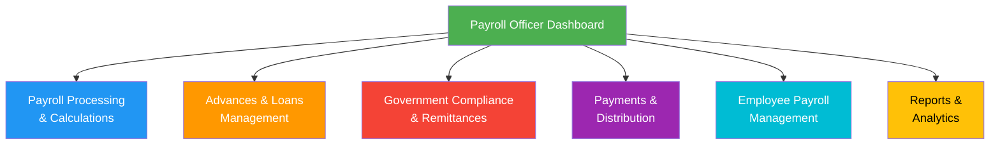
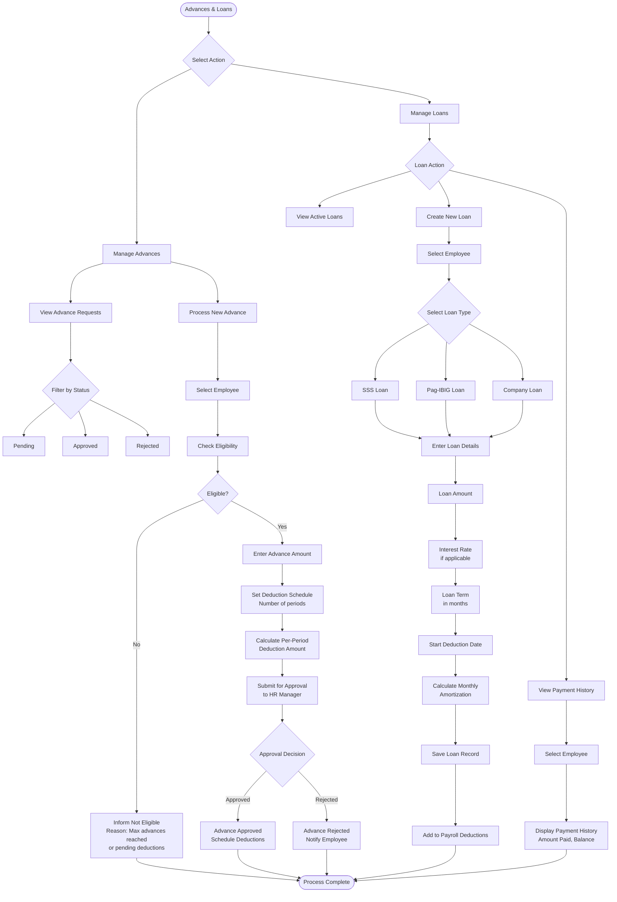
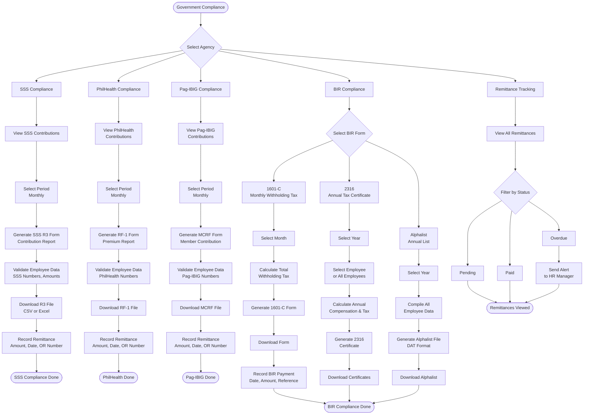
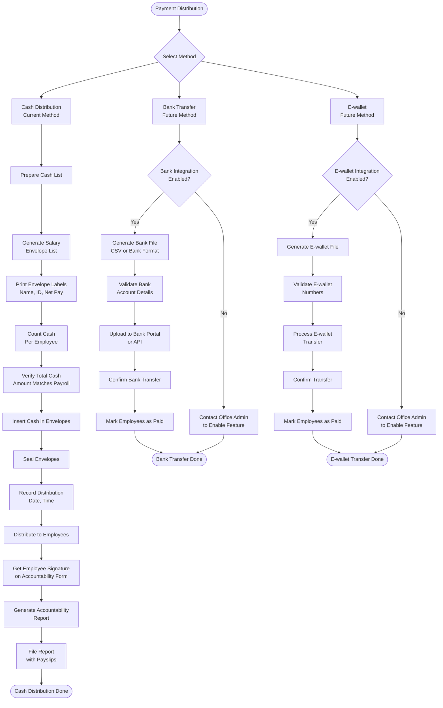
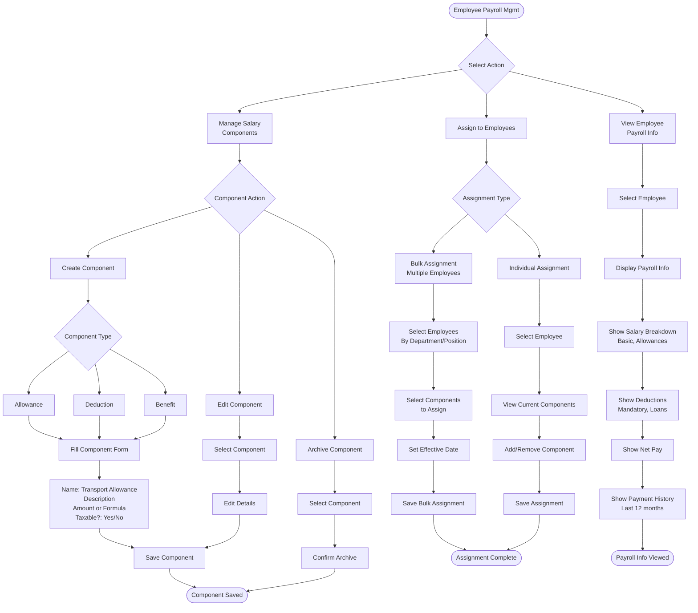
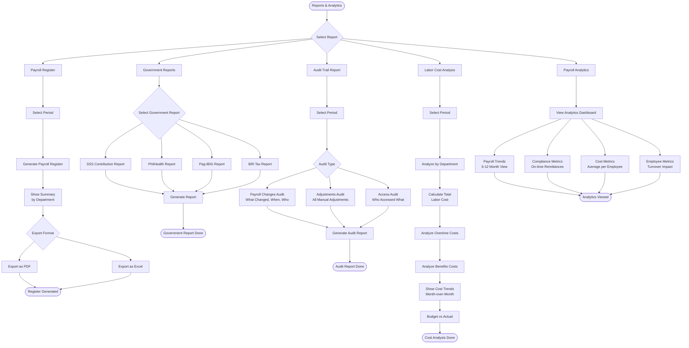

# Payroll Officer Workflow

## Role Overview
**Focus**: Complete payroll operations from calculation to payment distribution

### Core Responsibilities
- 💰 Payroll period processing and calculations
- 📊 Salary components and deductions management
- 💳 Employee advances and loans processing
- 🏛️ Government compliance and remittances (SSS, PhilHealth, Pag-IBIG, BIR)
- 💵 Payment distribution (currently cash-based)
- 📈 Payroll reports and analytics
- 🧾 Payslip generation and distribution

---

## Dashboard Overview



---

## 1. Payroll Processing & Calculations

### Purpose
Process payroll periods, run calculations, and generate employee payroll.

### Workflow



```mermaid
graph TD
    Start([Start Payroll Processing]) --> ManagePeriods[Manage Payroll Periods]
    
    ManagePeriods --> CreatePeriod[Create New Payroll Period]
    CreatePeriod --> SetDates[Set Period Dates<br/>Start, End, Cutoff, Pay Date]
    SetDates --> SavePeriod[Save Period]
    SavePeriod --> ActivatePeriod[Activate Period]
    
    ActivatePeriod --> RunCalculations[Run Payroll Calculations]
    RunCalculations --> FetchData[Fetch Timekeeping Data]
    FetchData --> ValidateAttendance{Attendance Valid?}
    
    ValidateAttendance -->|No| NotifyHR[Notify HR Staff<br/>for Corrections]
    NotifyHR --> WaitCorrection[Wait for Corrections]
    WaitCorrection --> FetchData
    
    ValidateAttendance -->|Yes| Calculate[Proceed with Calculations]
    
    Calculate --> CalcBasic[Calculate Basic Pay<br/>Days Worked × Daily Rate]
    CalcBasic --> CalcOT[Calculate Overtime<br/>OT Hours × Rate]
    CalcOT --> CalcHoliday[Calculate Holiday Pay<br/>Holiday × Multiplier]
    CalcHoliday --> CalcAllowances[Add Allowances<br/>Housing, Transport, etc.]
    CalcAllowances --> CalcBonuses[Add Bonuses<br/>Performance, 13th Month]
    CalcBonuses --> TotalGross[Calculate Total Gross Pay]
    
    TotalGross --> Deductions[Calculate Deductions]
    Deductions --> CalcSSS[SSS Contribution<br/>Based on Table]
    CalcSSS --> CalcPhilHealth[PhilHealth Premium<br/>2.5% of Salary]
    CalcPhilHealth --> CalcPagIbig[Pag-IBIG Contribution<br/>1-2% of Salary]
    CalcPagIbig --> CalcTax[Withholding Tax<br/>Based on BIR Table]
    CalcTax --> CalcLoans[Loan Deductions<br/>Monthly Amortization]
    CalcLoans --> CalcAdvances[Advance Deductions<br/>Per Schedule]
    CalcAdvances --> CalcOthers[Other Deductions<br/>Penalties, etc.]
    CalcOthers --> TotalDeductions[Calculate Total Deductions]
    
    TotalDeductions --> CalcNet[Calculate Net Pay<br/>Gross - Deductions]
    CalcNet --> SaveCalc[Save Calculations]
    SaveCalc --> ReviewPayroll[Review Payroll]
    
    ReviewPayroll --> CheckExceptions{Exceptions Found?}
    CheckExceptions -->|Yes| ReviewDetails[Review Exception Details]
    ReviewDetails --> NeedAdjustment{Need Adjustment?}
    NeedAdjustment -->|Yes| CreateAdjustment[Create Adjustment]
    NeedAdjustment -->|No| ApprovePayroll[Approve Payroll]
    CheckExceptions -->|No| ApprovePayroll
    
    CreateAdjustment --> AdjType{Adjustment Type}
    AdjType --> AddBonus[Add: Bonus, Allowance]
    AdjType --> DeductPenalty[Deduct: Penalty, Absence]
    AddBonus --> EnterAmt[Enter Amount & Reason]
    DeductPenalty --> EnterAmt
    EnterAmt --> SaveAdj[Save Adjustment]
    SaveAdj --> RecalcPayroll[Recalculate Payroll]
    RecalcPayroll --> ReviewPayroll
    
    ApprovePayroll --> ForwardHRManager[Forward to HR Manager<br/>for Review]
    ForwardHRManager --> HRDecision{HR Manager Review}
    HRDecision -->|Approved| ForwardOfficeAdmin[Forward to Office Admin<br/>for Final Approval]
    HRDecision -->|Rejected| ReviewDetails
    
    ForwardOfficeAdmin --> AdminDecision{Office Admin Decision}
    AdminDecision -->|Approved| LockPeriod[Lock Payroll Period]
    AdminDecision -->|Rejected| ReviewDetails
    
    LockPeriod --> GeneratePayslips[Generate Payslips<br/>for All Employees]
    GeneratePayslips --> Complete([Payroll Approved<br/>Ready for Payment])
```

### Payroll Period Schedule

**Semi-Monthly:**
- **Period 1**: 1st - 15th (Pay date: 15th)
- **Period 2**: 16th - End of month (Pay date: 30th/31st)

**Cutoff Dates:**
- Attendance cutoff: 2 days before pay date
- Adjustments cutoff: 1 day before pay date

### Calculation Formulas

**Basic Pay:**
```
Daily Rate = Monthly Salary / 22 working days
Basic Pay = Daily Rate × Days Worked
```

**Overtime Pay:**
```
Hourly Rate = Monthly Salary / 22 / 8
Regular OT = OT Hours × Hourly Rate × 1.25
Holiday OT = OT Hours × Hourly Rate × 2.0
Rest Day OT = OT Hours × Hourly Rate × 1.3
```

**Holiday Pay:**
```
Regular Holiday = Daily Rate × 2.0 (even if not worked)
Special Holiday = Daily Rate × 1.3 (if worked)
```

**SSS Contribution** (Based on table):
- Employee share: 4.5%
- Employer share: 9.5%
- Total: 14% of monthly salary credit

**PhilHealth Premium:**
```
Monthly Premium = Monthly Salary × 5%
Employee share = Premium × 50% (2.5%)
Employer share = Premium × 50% (2.5%)
```

**Pag-IBIG Contribution:**
```
Employee: 1-2% of monthly salary (max ₱5,000 base)
Employer: 2% of monthly salary (max ₱5,000 base)
```

**Withholding Tax** (Progressive rates):
- Based on BIR tax table
- After deductions (SSS, PhilHealth, Pag-IBIG)

---

## 2. Employee Advances & Loans Management

### Purpose
Process employee cash advances and manage loan deductions.

### Workflow



### Advance Eligibility Rules

**Employee is eligible if:**
- ✅ No existing unpaid advance
- ✅ Total deductions < 40% of gross pay
- ✅ Employed for at least 3 months
- ✅ No pending disciplinary action

**Maximum Advance Amount:**
- Up to 50% of monthly basic salary
- Maximum 2 advances per year

**Deduction Schedule:**
- Minimum: 2 pay periods
- Maximum: 6 pay periods
- Equal deductions per period

### Loan Types

**SSS Loan:**
- Salary loan from SSS
- Monthly amortization deducted from payroll
- Remitted to SSS monthly
- Tracked separately in government compliance

**Pag-IBIG Loan:**
- Multi-Purpose Loan (MPL) or Calamity Loan
- Monthly amortization deducted from payroll
- Remitted to Pag-IBIG monthly
- Tracked in government compliance

**Company Loan:**
- Internal company loan
- Interest rate: 0-5% (per company policy)
- Flexible terms: 3-24 months
- Deducted from payroll monthly

---

## 3. Government Compliance & Remittances

### Purpose
Generate government reports and manage remittances for SSS, PhilHealth, Pag-IBIG, and BIR.

### Workflow



### Government Remittance Schedule

| Agency | Form | Due Date | Penalty for Late |
|--------|------|----------|------------------|
| **SSS** | R3 Form | 10th of following month | 3% per month |
| **PhilHealth** | RF-1 | 10th of following month | 2% per month |
| **Pag-IBIG** | MCRF | 10th of following month | 3% per month |
| **BIR** | 1601-C | 10th of following month | 25% surcharge + 12% interest |

### Compliance Checklist (Monthly)

**Week 1 (After period closes):**
- ✅ Generate SSS R3 form
- ✅ Generate PhilHealth RF-1
- ✅ Generate Pag-IBIG MCRF
- ✅ Generate BIR 1601-C

**Week 2 (Before 10th):**
- ✅ Validate all data accuracy
- ✅ Download all files
- ✅ Submit to government agencies (online or in-person)
- ✅ Record remittance details (OR numbers, dates)

**Annual (January-February):**
- ✅ Generate BIR 2316 for all employees
- ✅ Generate Alphalist (DAT file)
- ✅ Submit to BIR
- ✅ Distribute 2316 to employees

---

## 4. Payments & Distribution

### Purpose
Manage payment distribution to employees (currently cash-based).

### Workflow



### Cash Distribution Process

**Preparation (1 day before payday):**
1. Generate final payroll register
2. Print salary envelope labels
3. Prepare cash breakdown per employee
4. Request cash from accounting/finance
5. Count and verify total cash amount

**Distribution Day:**
1. Setup secure distribution area
2. Call employees one by one (alphabetical or ID order)
3. Verify employee identity (ID card)
4. Hand salary envelope
5. Employee counts cash and verifies amount
6. Employee signs accountability form
7. Record signature and time
8. Move to next employee

**Post-Distribution:**
1. Count remaining cash (unclaimed salaries)
2. Generate accountability report
3. File report with HR Manager
4. Store unclaimed salaries securely
5. Follow up with absent employees

### Security Protocols

**Cash Handling:**
- ✅ Cash counting done by 2 people (Payroll Officer + witness)
- ✅ Distribution area secured (restricted access)
- ✅ Security personnel present during distribution
- ✅ CCTV recording of distribution process
- ✅ Safe storage for unclaimed salaries

---

## 5. Employee Payroll Management

### Purpose
Manage salary components, allowances, and deductions per employee.

### Workflow



### Common Salary Components

**Allowances (Typically Taxable):**
- Housing Allowance: ₱2,000-₱5,000/month
- Transportation Allowance: ₱1,000-₱3,000/month
- Meal Allowance: ₱500-₱1,500/month
- Communication Allowance: ₱500-₱1,000/month
- Clothing Allowance: Annual or quarterly

**De Minimis Benefits (Tax-Exempt up to limit):**
- Rice subsidy: ₱2,000/month
- Medical allowance: ₱1,500/month (₱10,000/year limit)
- Laundry allowance: ₱300/month
- Achievement awards: ₱10,000/year

**Deductions:**
- SSS contribution (mandatory)
- PhilHealth premium (mandatory)
- Pag-IBIG contribution (mandatory)
- Withholding tax (mandatory)
- SSS/Pag-IBIG loans
- Company loans
- Cash advances
- Uniform deductions
- Other authorized deductions

---

## 6. Reports & Analytics

### Purpose
Generate payroll reports and analyze payroll costs.

### Workflow



### Key Reports

**Payroll Register:**
- Complete list of all employees
- Gross pay, deductions, net pay
- Subtotals by department
- Grand total for period
- Used for accounting entries

**Government Reports:**
- SSS R3 form (monthly contributions)
- PhilHealth RF-1 (monthly premiums)
- Pag-IBIG MCRF (monthly contributions)
- BIR 1601-C (monthly withholding tax)
- BIR 2316 (annual tax certificate)
- Alphalist (annual employee list for BIR)

**Audit Trail:**
- All payroll changes logged
- Who made changes and when
- Before/after values
- Reason for change
- Used for internal audits

**Labor Cost Analysis:**
- Total labor cost by period
- Cost breakdown (basic, OT, benefits)
- Department comparison
- Cost trends over time
- Budget vs actual variance

---

## Common Tasks

### Daily Tasks
- ✅ Monitor pending payroll calculations
- ✅ Review and process advance requests
- ✅ Update loan balances
- ✅ Respond to employee payroll inquiries

### Weekly Tasks
- ✅ Review timekeeping data for upcoming period
- ✅ Process approved adjustments
- ✅ Verify government contribution rates
- ✅ Update payroll schedules

### Bi-Monthly Tasks (Payday)
- ✅ Run payroll calculations
- ✅ Review and approve payroll
- ✅ Generate payslips
- ✅ Prepare payment distribution (cash envelopes)
- ✅ Distribute payments to employees
- ✅ Generate accountability report

### Monthly Tasks
- ✅ Generate government compliance reports (R3, RF-1, MCRF, 1601-C)
- ✅ Submit government remittances by 10th
- ✅ Record remittance details
- ✅ Generate monthly payroll register
- ✅ Update loan schedules

### Quarterly Tasks
- ✅ Generate quarterly payroll reports
- ✅ Review payroll cost trends
- ✅ Audit payroll processes
- ✅ Verify government rate updates

### Annual Tasks
- ✅ Generate BIR 2316 for all employees (January-February)
- ✅ Generate Alphalist (January-February)
- ✅ Submit annual BIR reports
- ✅ Process 13th month pay (December)
- ✅ Annual payroll audit
- ✅ Update government rates (SSS, PhilHealth, Pag-IBIG, BIR)

---

## Key Performance Indicators (KPIs)

| KPI | Target | Measurement |
|-----|--------|-------------|
| Payroll Accuracy | 99.5% | % of error-free payrolls |
| On-time Payment | 100% | % of paydays met |
| Government Remittance On-time | 100% | % of remittances by due date |
| Payslip Distribution | 100% | % of employees receiving payslips |
| Calculation Time | < 4 hours | Time to complete calculations |
| Inquiry Resolution | < 24 hours | Time to resolve payroll queries |

---

## Best Practices

### Payroll Processing
- ✅ Start calculations 3 days before payday
- ✅ Double-check government rates quarterly
- ✅ Validate timekeeping data before calculating
- ✅ Review exceptions thoroughly before finalizing
- ✅ Get approvals (HR Manager + Office Admin) before payment

### Government Compliance
- ✅ Generate reports 5 days before due date (10th)
- ✅ Validate all employee government numbers
- ✅ Submit remittances 2-3 days before due date
- ✅ Keep copies of all OR numbers and receipts
- ✅ Set calendar reminders for due dates

### Data Security
- ✅ Restrict payroll data access to authorized users only
- ✅ Never share employee salary information
- ✅ Secure cash during distribution
- ✅ Lock payroll periods after finalization
- ✅ Regular backups of payroll data

### Accuracy
- ✅ Cross-check calculations with previous periods
- ✅ Verify new hires and separations in payroll
- ✅ Review all manual adjustments twice
- ✅ Reconcile total payroll with timekeeping
- ✅ Keep audit trail of all changes

---

## Troubleshooting

### Common Issues

**Issue: Attendance data incomplete or invalid**
- Check timekeeping module for missing punches
- Coordinate with HR Staff to correct data
- Verify RFID system is working
- Generate manual entry report for corrections

**Issue: Government remittance overdue**
- Check remittance tracking module
- Generate penalty calculation
- Submit immediately with penalty payment
- Set calendar reminder to avoid future delays

**Issue: Employee payroll calculation error**
- Review timekeeping data for employee
- Check if all allowances/deductions are correct
- Verify government contribution rates
- Recalculate and compare with previous period

**Issue: Cash shortage during distribution**
- Stop distribution immediately
- Recount total cash
- Check accountability form for errors
- Investigate discrepancy before continuing

**Issue: Employee disputes payslip amount**
- Review payroll calculation breakdown
- Check timekeeping records (attendance, OT, leaves)
- Verify deductions (loans, advances, absences)
- Explain calculation to employee
- Create adjustment if error confirmed

## Immutable Ledger & Replay Monitoring

- Payroll runs must only consume attendance sourced from the PostgreSQL ledger (`rfid_ledger`) persisted by the Replayable Event-Log Verification Layer.
- Payroll Officers monitor the replay layer's alerting/metrics (ledger commit latency, sequence gaps, hash mismatches, replay backlog) and pause payroll approvals whenever anomalies are raised.

---

## Related Documentation
- [System Overview](./00-system-overview.md)
- [HR Manager Workflow](./03-hr-manager-workflow.md)
- [HR Staff Workflow](./04-hr-staff-workflow.md)
- [Office Admin Workflow](./02-office-admin-workflow.md)
- [Payroll Module Architecture](../PAYROLL_MODULE_ARCHITECTURE.md)
- [RBAC Matrix](../RBAC_MATRIX.md)

---

**Last Updated**: November 29, 2025  
**Role**: Payroll Officer  
**Access Level**: Full Payroll Access (View, Create, Edit, Approve payroll - Subject to HR Manager + Office Admin final approval)
