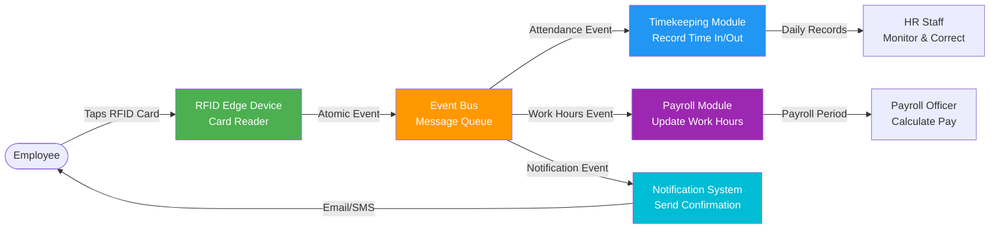
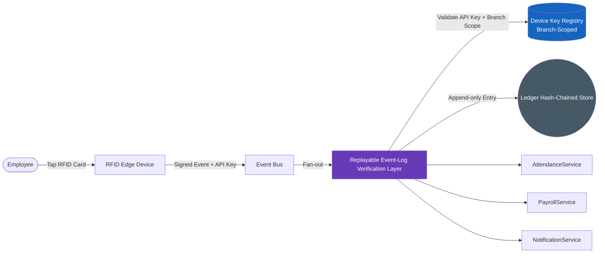
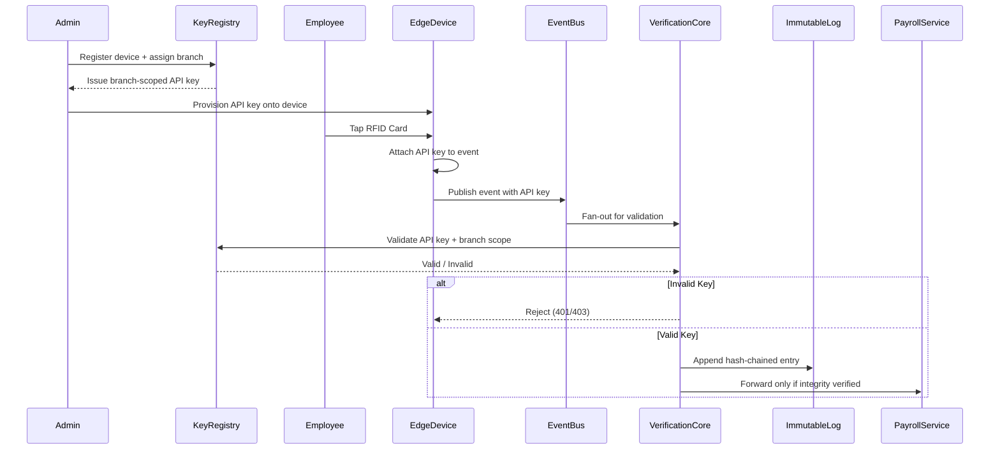

# RFID Replayable Event-Log Verification Layer (Patent-Oriented Proposal)

> This document is the proposal companion to `rfid-integration.md`. It mirrors diagrams, flows, and checklists from the integration guide, but focuses on tamper-resistant, replayable ledger mechanisms with deterministic reconciliation and automated business workflow gating, highlighting potentially patentable innovations.

---

## Purpose

Create a **tamper-resistant, cryptographically verifiable event ledger** that:

1. Sequences, hashes, and stores every RFID event in an append-only PostgreSQL ledger.
2. Enables deterministic replay of past events for reconciliation and labor audits.
3. Integrates **ledger integrity enforcement with business workflow gating**, ensuring payroll actions cannot proceed on inconsistent or tampered data.
4. Enforces **device-level authentication** through branch-scoped API keys, ensuring only registered and authorized edge devices can submit events to the ledger.

> The novelty lies not in using an event bus or logging events, but in the **ledger-backed replay orchestration** combined with **automatic integrity-driven workflow gating** and **branch-scoped device identity enforcement**.

---

## Key Patent-Oriented Innovations

| Innovation | Description | Potential Novelty |
|------------|-------------|-------------------|
| **Tamper-evident Replay Ledger** | Each event receives a sequential ID and a cryptographic hash chained to the previous record (`curr_hash = SHA-256(prev_hash \|\| payload)`). | Coupling a local hash-chained ledger with **live payroll gating** is atypical inside HRIS products. |
| **Deterministic Replay Orchestration** | Ledger rows stream in strict sequence order, handling duplicate events and offline device catch-up. | A **deterministic replay engine** that simultaneously enforces integrity and resolves inconsistencies automatically is non-trivial. |
| **Workflow Gating on Ledger Health** | Payroll approvals halt when health metrics show sequence gaps, hash failures, or processing backlog. | Directly binding **ledger health telemetry** to business workflow enforcement creates a defensible, automated control plane. |
| **Edge Buffering with Guaranteed Consistency** | The RFID edge device operates independently via a local SQLite buffer when offline. On reconnect, buffered events are flushed in strict chronological order. | Decoupling data capture from central processing while guaranteeing eventual ledger consistency is a core resilience innovation. |
| **Branch-Scoped API Key Device Registration** | Admin/IT registers each timekeeping device against a specific branch or location. The server issues a branch-scoped API key tied to that device. All incoming events are validated against this key before ledger insertion. Unregistered or invalid-key events are rejected outright. | Binding device identity and physical location to ledger write access — and hard-rejecting unregistered sources — creates a verifiable chain of custody from the physical tap point to the immutable ledger entry. |
| **Audit Snapshot Automation** *(optional extension)* | Daily hash snapshots exported to immutable storage targets (e.g., WORM/object-lock: MinIO Object Lock, NetApp SnapLock). | Automating immutable snapshots tied to ledger state strengthens legal defensibility beyond generic backups. |

---

## System Architecture
### from `rfid-integration.md`



---

## High-Level Architecture (Patent Focus)



**Focus:**

- `VerificationCore` enforces API key validation, hash-chain validation, sequence ordering, and **automated downstream gating**.
- `KeyRegistry` stores branch-scoped device credentials issued during Admin/IT registration. Events from unregistered devices are rejected before any ledger insertion occurs.
- `ImmutableLog` remains append-only and tamper-evident, forming the **core inventive data structure**.
- The edge device operates independently via a local SQLite buffer when the server is offline. On reconnect, a Sync Engine flushes events to the central ledger in strict chronological order — still subject to API key validation on arrival.

---

## Device Registration & API Key Mechanism

### Registration Flow

Admin/IT registers a timekeeping device through the system admin panel. The registration process:

1. Admin creates a new device record, supplying the hardware identifier and assigning it to a **branch or location**.
2. The server generates a **branch-scoped API key** bound to that device-branch pairing and stores it in the Device Key Registry.
3. The API key is provisioned onto the edge device (manual entry or automated provisioning).
4. The device includes this API key in the header of every event submission to the central ledger API.

### Key Schema

```sql
CREATE TABLE device_key_registry (
  device_id       UUID PRIMARY KEY,
  api_key_hash    BYTEA NOT NULL,       -- hashed; never stored in plaintext
  branch_id       UUID NOT NULL,
  registered_by   UUID NOT NULL,        -- admin/IT user reference
  registered_at   TIMESTAMPTZ NOT NULL,
  is_active       BOOLEAN DEFAULT TRUE,
  last_seen_at    TIMESTAMPTZ
);
```

### Validation at Event Ingestion

Before any event is written to the ledger, the Verification Core performs:

```
1. Extract API key from request header.
2. Look up device_key_registry by hashed key.
3. Assert is_active = TRUE.
4. Assert event.branch_id matches registry.branch_id.
5. If any assertion fails → reject event (HTTP 401/403), log rejection.
6. If all assertions pass → proceed to hash-chain insertion.
```

### Rejection Behavior

Events submitted with an **invalid, revoked, or branch-mismatched API key** are:

- **Rejected outright** — not buffered, not queued, not inserted into the ledger.
- Logged to a separate `rejected_events` table with reason code, device identifier, and timestamp for audit purposes.
- The originating device receives an explicit rejection response, not a silent drop.

This hard rejection policy ensures the ledger only ever contains events from physically registered, location-verified devices, strengthening the chain of custody from tap to payroll.

### Revocation

Admin/IT can deactivate a device key at any time (`is_active = FALSE`). Subsequent events from that device are immediately rejected without requiring key rotation across the system.

---

## Replay Layer Operations (Patent Focus)

1. **Ledger Schema (Append-Only)**

  ```sql
  CREATE TABLE rfid_events_ledger (
    sequence_id  BIGINT PRIMARY KEY,
    event_id     UUID,
    device_id    UUID REFERENCES device_key_registry(device_id),
    branch_id    UUID,
    payload      JSONB,
    prev_hash    BYTEA,
    curr_hash    BYTEA,
    created_at   TIMESTAMPTZ
  );
  ```

  > `device_id` and `branch_id` are now carried into every ledger row, making the registration context part of the immutable record.

  > **Note on device signatures:** Ed25519 per-device signing is a planned extension for deployments requiring end-to-end cryptographic origin proof beyond API key authentication.

2. **Hashing**

  - Uses `pgcrypto.digest(prev_hash || payload, 'sha256')` to extend the chain.
  - Any modification to a past record breaks all subsequent hashes, making tampering immediately detectable.

3. **Deterministic Replay Engine**

  - Streams ledger rows in strict `sequence_id` order.
  - Feeds timekeeping, payroll, and notification subscribers **only after integrity checks pass**.
  - Handles duplicate events (configurable deduplication window) and offline device catch-up.
  - Automatically blocks payroll approvals if:
    - Hash mismatches are detected.
    - Sequence gaps are found in the ledger.
    - Replay backlog grows beyond acceptable thresholds.

4. **Automated Checkpointing** *(optional extension)*

  - Daily ledger snapshots can be exported to an on-prem WORM/object-lock target (e.g., MinIO Object Lock, NetApp SnapLock, Dell ECS) for immutable legal evidence.

---

## Deterministic Orchestration & Gating Logic

The potentially patentable control plane is the deterministic orchestration that **prevents** business workflows from progressing unless ledger integrity is mathematically proven and all contributing events originate from registered, branch-verified devices.

### Orchestration Steps

1. **Ingest & Authenticate**
  - Accept RFID events from direct online taps or offline cache drains from the edge device.
  - Validate API key against the Device Key Registry and assert branch scope before any further processing.
  - Hard-reject events from unregistered or mismatched devices.

2. **Order & Validate**
  - Linearize authenticated events by `sequence_id`.
  - Hash mismatch immediately quarantines the affected window and emits a `ledger.health.blocked` control event.
  - Stalled sequence IDs trigger automated replay jobs before downstream data is released.

3. **Gate Business Actions**
  - Payroll and timekeeping consumers subscribe to `verification.decisions` rather than raw events.
  - Only `decision=integrity_passed` releases cumulative attendance hours to the payroll calculation engine.
  - `decision=integrity_blocked` carries machine-readable reasons (gap, hash failure, backlog, unregistered device) so workflows pause automatically without manual intervention.

4. **Payroll Calculation Flow**
  - Once a payroll period is approved and the ledger is verified, the Timekeeping Engine aggregates daily attendance summaries (`time_in · time_out · total_hours`) derived from the raw RFID tap events.
  - The Payroll Officer initiates batch calculation, which applies salary components, allowances, deductions, and loan repayments.
  - The resulting attendance summaries feed the Payroll Processor (hours × rate → payslips) only after ledger-backed verification has cleared.

### Control Logic Highlights

- **Integrity-as-a-Service**: Downstream services never implement their own integrity checks; they trust the verification core's verdicts.
- **Replay-before-pay**: Any anomaly spawns a replay job scoped to the offending range; payroll stays blocked until the job emits `replay_complete` with a verified checksum.
- **Device Identity as Ledger Precondition**: No event enters the hash chain without passing device registration validation first, making the physical tap point part of the cryptographic provenance.

---

## Event Flow (Patent Focus)



**Key point:** downstream modules receive **only cryptographically validated events from registered, branch-verified devices**, enforced automatically at every ingestion point.

---

## Why This Could Be Patentable

1. **Process Claim Target**: "A method for enforcing payroll actions using cryptographically verified event streams from branch-authenticated edge devices" — covering ingestion, device key validation, hash chain construction, deterministic replay, and integrity-gated business execution.
2. **Device Identity Binding**: Tying a physical edge device to a branch scope via API key registration, and making that identity an immutable part of every ledger row, creates a verifiable chain of custody from the physical tap point to the payroll output.
3. **Hard Rejection Policy**: Rejecting unauthenticated events before ledger insertion — rather than flagging them post-hoc — is a specific architectural choice that strengthens the integrity guarantee and differentiates this from generic audit logging.
4. **Workflow Gating Logic**: Binding machine-readable integrity verdicts (including device authentication failures) to payroll/timekeeping approvals ensures no human can bypass the control path.
5. **Immutable Checkpoint Evidence**: Daily checkpoints tied to gating decisions produce a verifiable audit trail that substantiates the enforcement mechanism, supporting a systems-level claim rather than a storage claim.

Taken together, the branch-scoped device registration, deterministic orchestration, and automated gating workflow describe an enforceable control layer that is more specific than "hash + ledger + replay," giving a sharper patent narrative.

---

**Related Documentation**
- [RFID Timekeeping Integration](./../rfid-integration.md)
- [Timekeeping Module Architecture](../../TIMEKEEPING_MODULE_ARCHITECTURE.md)
- [Payroll Module Architecture](../../PAYROLL_MODULE_ARCHITECTURE.md)
