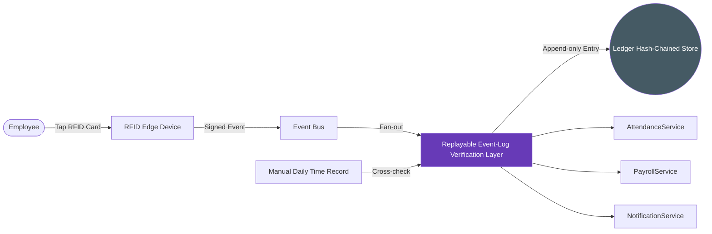
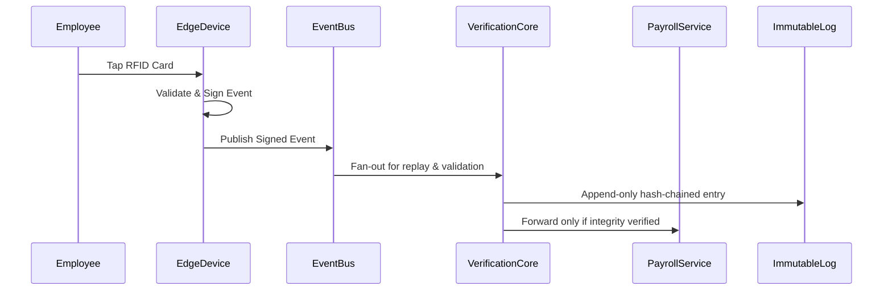

# RFID Replayable Event-Log Verification Layer (Patent-Oriented Proposal)

> This document reframes the `rfid-integration.md` architecture to highlight **tamper-resistant, replayable ledger mechanisms** with deterministic reconciliation and automated business gating, focusing on potentially patentable innovations.

---

## Purpose

Create a **tamper-resistant, cryptographically verifiable event ledger** that:

1. Sequences, hashes, and stores every RFID event in an append-only PostgreSQL ledger.
2. Enables deterministic replay of past events for MDTR reconciliation and labor audits.
3. Integrates **ledger integrity enforcement with business workflow gating**, ensuring payroll actions cannot proceed on inconsistent or tampered data.

> The novelty lies not in using an event bus or logging events, but in the **ledger-backed replay orchestration** combined with **automatic integrity-driven workflow gating**.

---

## Key Patent-Oriented Innovations

| Innovation | Description | Potential Novelty |
|------------|-------------|-------------------|
| **Tamper-evident Replay Ledger** | Each event receives a sequential ID, cryptographic hash, and optional Ed25519 signature with chained hashes (`curr_hash = hash(prev_hash \|\| payload)`). | Coupling a local hash-chained ledger with **live payroll gating and MDTR reconciliation** is atypical inside HRIS products. |
| **Deterministic Replay Orchestration** | Ledger rows stream in order, handling duplicate events, offline device catch-up, and MDTR cross-verification. | A **deterministic replay engine** that simultaneously enforces integrity and resolves inconsistencies automatically is non-trivial. |
| **Workflow Gating on Ledger Health** | Payroll approvals halt when health metrics show gaps, hash failures, or backlog delays. | Directly binding **ledger health telemetry** to business workflow enforcement creates a defensible, automated control plane. |
| **Audit Snapshot Automation** | Daily hash snapshots exported to on-prem WORM/object-lock storage (MinIO Object Lock, NetApp SnapLock, Dell ECS). | Automating immutable snapshots tied to ledger state strengthens legal defensibility beyond generic backups. |
| **MDTR Cross-Check Engine** | Manual records reconcile against the cryptographic ledger with deterministic, repeatable jobs. | Applying tamper-evident verification to merge manual and electronic logs offers a novel HR compliance workflow. |

---

## High-Level Architecture (Patent Focus)



**Focus:**

- `VerificationCore` enforces hash-chain validation, sequence ordering, MDTR reconciliation, and **automated downstream gating**.
- `ImmutableLog` remains append-only and tamper-evident, forming the **core inventive data structure**.

---

## Replay Layer Operations (Patent Focus)

1. **Ledger Schema (Append-Only)**

  ```sql
  CREATE TABLE rfid_events_ledger (
    sequence_id BIGINT PRIMARY KEY,
    event_id UUID,
    payload JSONB,
    prev_hash BYTEA,
    curr_hash BYTEA,
    device_signature BYTEA,
    created_at TIMESTAMPTZ
  );
  ```

2. **Hashing & Signatures**

  - Uses `pgcrypto.digest(prev_hash || payload, 'sha256')` to extend the chain.
  - Optional Ed25519 device signatures prove origin when auditors require end-to-end authenticity.

3. **Deterministic Replay Engine**

  - Streams ledger rows in order and feeds timekeeping, payroll, and notification subscribers **only after integrity checks pass**.
  - Handles duplicates, offline device catch-up, and MDTR cross-verification with deterministic jobs.
  - Automatically blocks payroll approvals if:
    - Hash mismatches or sequence gaps surface.
    - Ledger commit latency exceeds 3 seconds for more than 5 minutes.
    - Replay backlog spans beyond two payroll periods.

4. **Automated Checkpointing**

  - Daily ledger snapshots exported to an on-prem WORM/object-lock target (e.g., MinIO Object Lock, NetApp SnapLock, Dell ECS) for immutable legal evidence.

---

## Deterministic Orchestration & Gating Logic

The potentially patentable control plane is the deterministic orchestration that merges heterogeneous records and **prevents** business workflows from progressing unless integrity is mathematically proven.

### Orchestration Steps

1. **Ingest & Classify**
  - Accept RFID events, offline cache drains, MDTR scans, and manual corrections.
  - Tag each input with provenance metadata (device, operator, document hash).
2. **Order & Validate**
  - Linearize events by `sequence_id`; stalled IDs trigger automated replay jobs before downstream data is released.
  - Hash mismatch immediately quarantines the affected window and emits a `ledger.health.blocked` control event.
3. **Reconcile Sources**
  - Deterministic replay compares ledger entries against MDTR rows, applying a finite-state machine:
    - `pending_mdtr` → `matched` when ledger + paper align.
    - `pending_mdtr` → `contested` when ledger shows divergent tap times.
  - Duplicate taps collapse via configurable windows but retain provenance for audit.
4. **Gate Business Actions**
  - Payroll/timekeeping consumers subscribe to `verification.decisions` rather than raw events.
  - Only `decision=integrity_passed` releases cumulative hours, overtime, or notifications.
  - `decision=integrity_blocked` carries machine-readable reasons (gap, hash, backlog, MDTR mismatch) so workflows pause automatically.

### Control Logic Highlights

- **Integrity-as-a-Service**: Downstream services never implement their own checks; they trust the verification core’s signed verdicts.
- **Replay-before-pay**: Any anomaly spawns a replay job scoped to the offending range; payroll stays blocked until the job emits `replay_complete` with a signed checksum.
- **MDTR Enforcement Loop**: Paper submissions referencing a ledger window cannot close until the replay engine produces a matching digest, guaranteeing deterministic reconciliation rather than best-effort alerts.

This closed-loop control system—tying deterministic replay, MDTR reconciliation, and automated gating—forms the heart of the inventive concept.

---

## Event Flow (Patent Focus)



**Key point:** downstream modules receive **only cryptographically validated events**, enforced automatically.

---

## Why This Could Be Patentable

1. **Process Claim Target**: “A method for enforcing payroll actions using cryptographically verified event streams” that includes ingesting multi-source records, hash validating them, deterministically replaying them, and emitting a blocking decision signal prior to business execution.
2. **Automated MDTR Reconciliation Loop**: The closed-loop replay that compares ledger entries with manual documents, forces resolution, and only then releases downstream data goes beyond obvious discrepancy flagging.
3. **Workflow Gating Logic**: Binding machine-readable integrity verdicts to payroll/timekeeping approvals ensures no human can bypass the control path, differentiating it from traditional logging plus manual review.
4. **Immutable Checkpoint Evidence**: Daily checkpoints tied to gating decisions produce a verifiable audit trail that substantiates the enforcement mechanism, supporting a systems-level claim rather than a storage claim.

Taken together, the deterministic orchestration, MDTR reconciliation, and automated gating workflow describe an enforceable control layer that is more specific than “hash + ledger + replay,” giving a sharper patent narrative.

---

**Related Documentation**
- [RFID Timekeeping Integration](./rfid-integration.md)
- [Timekeeping Module Architecture](../../TIMEKEEPING_MODULE_ARCHITECTURE.md)
- [Payroll Module Architecture](../../PAYROLL_MODULE_ARCHITECTURE.md)
