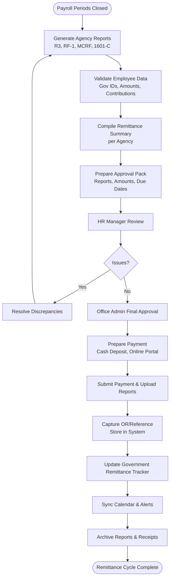

# Government Remittances Process

## Overview
Monthly workflow for compiling statutory contributions and taxes after payroll, preparing agency reports, submitting payments, and tracking receipts for SSS, PhilHealth, Pag-IBIG, and BIR.

**Participants**: Payroll Officer (owner) → HR Manager (review) → Office Admin (final approval) → Accounting (optional witness)

**Due Date**: 10th of the following month for all agencies.

---

## Complete Remittance Flow

---

## Agency-Specific Steps

### SSS (R3 Form)
1. Generate R3 file (CSV) and summary using Payroll → Government → SSS.
2. Validate employee SSS numbers, contribution caps, and EC share.
3. Upload via SSS EPRS / submit at branch (if required).
4. Pay via bank or online; capture PRN and receipt.

### PhilHealth (RF-1)
1. Generate RF-1 report; ensure premium tiers correct.
2. Validate PhilHealth numbers and salary base.
3. Upload via PhilHealth EPRS portal.
4. Pay via online banking; record OR number.

### Pag-IBIG (MCRF)
1. Generate MCRF contribution file and loan deduction list.
2. Validate Pag-IBIG MID numbers and loan references.
3. Upload via Pag-IBIG Virtual Pag-IBIG / eSRS.
4. Pay via accredited bank; store payment reference.

### BIR (Form 1601-C)
1. Generate 1601-C withholding tax return.
2. Include total compensation and tax withheld for month.
3. File via eFPS (or authorized bank if manual).
4. Pay tax due; capture BIR acknowledgment number.

---

## Timeline & Checklist

| Week | Target Date | Activities |
|------|-------------|------------|
| **Week 1 (Day 1-3)** | Immediately after month close | Generate R3, RF-1, MCRF, 1601-C | 
| **Week 1 (Day 4-5)** | Before 5th | Validate data, resolve discrepancies, prepare approval pack |
| **Week 2 (Day 6-7)** | 6th-7th | HR Manager review, Office Admin approval |
| **Week 2 (Day 8-9)** | 8th-9th | Upload reports, process payments |
| **Week 2 (Day 10)** | Due date | Confirm payments posted, update trackers, archive documentation |

---

## Penalties & Monitoring

| Agency | Penalty | Notes |
|--------|---------|-------|
| **SSS** | 3% per month | Applied on outstanding contribution |
| **PhilHealth** | 2% per month | Compounded monthly |
| **Pag-IBIG** | 3% per month | Applies to total due |
| **BIR** | 25% surcharge + 12% annual interest | Plus compromise penalties |

**Tracker Alerts**:
- Overdue remittances trigger red alert in Government Remittance dashboard
- Calendar displays due dates and status (pending/paid/late)

---

## Integration Points
- **Payroll Processing**: Provides contribution totals per employee and agency
- **Government Remittance Tracker**: Central view (Inertia page + controller) for statuses, references, penalties
- **Accounting**: Receives payment references for ledger posting
- **Notifications**: Slack/email alerts for upcoming due dates and overdue statuses

---

## Roles & Responsibilities
- **Payroll Officer**: Generate reports, validate data, submit payments, upload receipts
- **HR Manager**: Review accuracy, ensure headcount coverage, sign-off before payment
- **Office Admin**: Approve remittance release, ensure cashflow availability, configure penalties and due date reminders
- **Superadmin (optional)**: Emergency override for portal access issues

---

## KPIs & Targets
- On-time remittances: ≥ 99%
- Data discrepancy rate: < 1% per run
- Receipt archiving compliance: 100%
- Overdue days per year: 0 (target)

---

## Common Issues & Resolutions
- **Incorrect government IDs** → HR Staff updates employee profile, regenerate report
- **Portal downtime** → Use bank over-the-counter fallback; document incident
- **Payment reference missing** → Re-download confirmation from portal; attach PDF to tracker
- **Late submission risk** → escalate to Office Admin for rush payment; compute penalty automatically

## Immutable Ledger & Replay Monitoring

- Contribution totals originate from payroll runs that depend on the PostgreSQL ledger (`rfid_ledger`) recorded by the Replayable Event-Log Verification Layer; remittance prep must confirm ledger-aligned attendance data.
- Payroll Officers and reviewers should watch the replay layer's alerting/metrics (ledger commit latency, sequence gaps, hash mismatches, replay backlog) before filing to avoid propagating unverified hours into government reports.

---

## Related Documentation
- [Payroll Processing Workflow](./payroll-processing.md)
- [Payroll Officer Workflow](../05-payroll-officer-workflow.md)
- [HR & Payroll Config](../../HR_PAYROLL_CONFIG.md)
- [Payroll Module Architecture](../../PAYROLL_MODULE_ARCHITECTURE.md)

---

**Last Updated**: November 29, 2025  
**Process Owner**: Payroll Department  
**Due Date**: 10th of following month for all agencies
