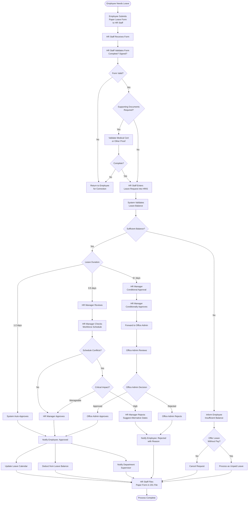

# Leave Request Approval Process

## Overview
End-to-end process for employee leave requests, from submission to approval and calendar updates.

**Participants**: Employee → HR Staff → HR Manager → Office Admin (conditional)

---

## Process Flow

---

## Approval Matrix

| Duration | Auto-Approve | HR Manager | Office Admin |
|----------|--------------|------------|--------------|
| **1-2 days** | ✅ Yes (if balance sufficient) | 🔔 Notified only | 🔔 Notified only |
| **3-5 days** | ❌ No | ✅ Full approval authority | 🔔 Notified only |
| **6+ days** | ❌ No | ✅ Conditional approval | ✅ Final approval required |

---

## Supporting Documents Required

| Leave Type | Duration | Required Documents |
|------------|----------|-------------------|
| **Sick Leave** | 1-2 days | None (but may be requested) |
| **Sick Leave** | 3+ days | ✅ Medical Certificate required |
| **Maternity Leave** | All | ✅ Medical Certificate from OB-GYN |
| **Paternity Leave** | All | ✅ Birth Certificate or Medical Cert |
| **Solo Parent Leave** | All | ✅ Solo Parent Certificate |
| **Bereavement Leave** | All | ✅ Death Certificate |
| **Emergency Leave** | All | ✅ Proof (hospital records, police report, etc.) |
| **Vacation Leave** | All | None |

---

## Timeline

### Submission
- **Advance Notice**: Minimum 3 days (for planned leave)
- **Emergency Leave**: Can be filed retroactively with proof

### Approval Timeline
- **1-2 days leave**: Instant (auto-approved)
- **3-5 days leave**: 24 hours (HR Manager review)
- **6+ days leave**: 48-72 hours (HR Manager + Office Admin)

### Notification
- Employee notified via email within 1 hour of decision
- Department supervisor notified for approved leaves
- Leave calendar updated immediately

---

## Rejection Reasons

**Common reasons for rejection:**
1. ❌ Insufficient leave balance (and employee declines unpaid leave)
2. ❌ Critical schedule conflict (busy period, insufficient coverage)
3. ❌ Inadequate advance notice (< 3 days for non-emergency)
4. ❌ Multiple concurrent leave requests from same department
5. ❌ Missing or invalid supporting documents
6. ❌ Previous unresolved leave issues

**HR Manager/Office Admin must provide:**
- Clear rejection reason
- Suggested alternative dates (if applicable)
- Next steps for employee

---

## Leave Without Pay (LWOP)

**When offered:**
- Employee has insufficient paid leave balance
- Employee still needs time off

**Process:**
1. HR Staff informs employee of insufficient balance
2. Offers Leave Without Pay option
3. If accepted, processes as unpaid leave
4. Payroll deduction applied (proportional to days absent)
5. Does not deduct from leave balance

**Approval:**
- Same approval workflow as paid leave
- Clearly marked as "Unpaid" in system

---

## System Integration

**Leave Module → Timekeeping Module:**
- Approved leave automatically marked in attendance
- No "absent" flag for approved leave days
- Leave days don't count as missed punches

**Leave Module → Payroll Module:**
- Paid leave: No salary deduction
- Unpaid leave: Automatic salary deduction
- Leave conversion to cash (if applicable)

**Leave Module → Workforce Management:**
- Approved leave removes employee from available pool
- Shift assignments adjusted automatically
- Coverage needs flagged for supervisor

---

## Roles & Responsibilities

### Employee
- Submit leave form with complete information
- Provide supporting documents if required
- Submit with minimum 3 days advance notice (planned leave)
- Accept or negotiate alternative dates if rejected

### HR Staff
- Receive and validate leave forms
- Enter leave requests into HRIS
- Check leave balance and eligibility
- Notify employee of decision
- File approved/rejected forms in 201 file
- Update leave calendar

### HR Manager
- Review 3-5 day leave requests (full approval)
- Review 6+ day leave requests (conditional approval)
- Check workforce schedule for conflicts
- Approve or reject with reason
- Forward 6+ day requests to Office Admin

### Office Admin
- Final approval for 6+ day leave requests
- Consider business impact and coverage
- Approve or reject with reason
- Receives notifications for all approvals (audit trail)

## Immutable Ledger & Replay Monitoring

- Approved leave blocks must reconcile with attendance captured in the PostgreSQL ledger (`rfid_ledger`) via the Replayable Event-Log Verification Layer so payroll doesn't see conflicting punches.
- HR Staff, HR Managers, and Office Admins should monitor replay-layer alerting/metrics (ledger commit latency, sequence gaps, hash mismatches, replay backlog) before finalizing leave that overlaps with flagged days.

---

## Metrics & Reporting

**Leave Utilization Report:**
- Leave taken vs. available by employee
- Leave balance by employee
- Leave patterns (seasonal, departmental)
- Carryover and forfeited leaves

**Approval Metrics:**
- Average approval time by duration
- Approval vs. rejection rate
- Most common rejection reasons
- Leave requests by type and department

---

## Related Documentation
- [HR Staff Workflow](../04-hr-staff-workflow.md) - Leave input process
- [HR Manager Workflow](../03-hr-manager-workflow.md) - Leave approval authority
- [Office Admin Workflow](../02-office-admin-workflow.md) - Leave policies configuration
- [System Overview](../00-system-overview.md) - System architecture

---

**Last Updated**: November 29, 2025  
**Process Owner**: HR Department  
**Approval Authority**: HR Manager (3-5 days), Office Admin (6+ days)
