# Payroll Processing Workflow

## Overview
Complete end-to-end payroll processing from period creation to payment distribution.

**Participants**: Payroll Officer → HR Manager → Office Admin → Employees

**Frequency**: Semi-monthly (15th and 30th/31st)

---

## Complete Process Flow

```mermaid
graph TD
    Start([Start Payroll Period]) --> CreatePeriod[Payroll Officer<br/>Creates Period]
    CreatePeriod --> SetDates[Set Period Dates<br/>Start, End, Cutoff, Pay Date]
    SetDates --> ActivatePeriod[Activate Period]
    
    ActivatePeriod --> CutoffReached{Cutoff Date<br/>Reached?}
    CutoffReached -->|No| WaitCutoff[Wait for Cutoff]
    WaitCutoff --> CutoffReached
    CutoffReached -->|Yes| FetchData[Fetch Timekeeping Data]
    
    FetchData --> ValidateData{Data Valid?}
    ValidateData -->|No| NotifyHR[Notify HR Staff<br/>Missing/Invalid Data]
    NotifyHR --> HRCorrects[HR Staff Corrects Data]
    HRCorrects --> FetchData
    ValidateData -->|Yes| RunCalculations[Run Payroll Calculations]
    
    RunCalculations --> CalcGross[Calculate Gross Pay<br/>Basic + OT + Holiday + Allowances]
    CalcGross --> CalcDeductions[Calculate Deductions<br/>SSS + PhilHealth + Pag-IBIG + Tax]
    CalcDeductions --> CalcLoans[Deduct Loans & Advances]
    CalcLoans --> CalcNet[Calculate Net Pay<br/>Gross - Deductions]
    CalcNet --> SaveCalculations[Save Calculations]
    
    SaveCalculations --> ReviewPayroll[Payroll Officer<br/>Reviews Calculations]
    ReviewPayroll --> CheckExceptions{Exceptions Found?}
    CheckExceptions -->|Yes| ReviewDetails[Review Exception Details]
    ReviewDetails --> NeedAdjustment{Need Adjustment?}
    NeedAdjustment -->|Yes| CreateAdjustment[Create Manual Adjustment<br/>Bonus, Penalty, etc.]
    NeedAdjustment -->|No| ContinueReview[Continue Review]
    CreateAdjustment --> Recalculate[Recalculate Payroll]
    Recalculate --> ReviewPayroll
    CheckExceptions -->|No| ContinueReview
    
    ContinueReview --> PayrollOfficerApprove[Payroll Officer<br/>Approves Calculations]
    PayrollOfficerApprove --> ForwardHRManager[Forward to HR Manager]
    
    ForwardHRManager --> HRManagerReview[HR Manager Reviews<br/>Payroll Data]
    HRManagerReview --> HRChecks[Check for:<br/>- Unusual amounts<br/>- Missing employees<br/>- Exceptions]
    HRChecks --> HRDecision{HR Manager Decision}
    HRDecision -->|Rejected| ReturnToPayroll[Return to Payroll Officer<br/>with Comments]
    ReturnToPayroll --> ReviewPayroll
    HRDecision -->|Approved| HRApproves[HR Manager Approves]
    
    HRApproves --> ForwardOfficeAdmin[Forward to Office Admin]
    ForwardOfficeAdmin --> AdminReview[Office Admin Reviews]
    AdminReview --> AdminChecks[Final Review:<br/>- Total payroll amount<br/>- Budget compliance<br/>- No anomalies]
    AdminChecks --> AdminDecision{Office Admin Decision}
    AdminDecision -->|Rejected| ReturnToHR[Return with Comments]
    ReturnToHR --> ReviewPayroll
    AdminDecision -->|Approved| AdminApproves[Office Admin<br/>Final Approval]
    
    AdminApproves --> LockPeriod[Lock Payroll Period<br/>No further changes allowed]
    LockPeriod --> GeneratePayslips[Generate Payslips<br/>for All Employees]
    GeneratePayslips --> PreparPayment[Prepare Payment]
    
    PreparPayment --> PaymentMethod{Payment Method}
    PaymentMethod -->|Cash Current| PrepareCash[Prepare Cash Distribution]
    PaymentMethod -->|Bank Future| PrepareBank[Prepare Bank Transfer]
    PaymentMethod -->|E-wallet Future| PrepareEwallet[Prepare E-wallet Transfer]
    
    PrepareCash --> CountCash[Count Cash<br/>Per Employee]
    CountCash --> PrepareEnvelopes[Prepare Salary Envelopes]
    PrepareEnvelopes --> VerifyCash[Verify Total Amount]
    VerifyCash --> DistributionDay[Distribution Day]
    
    PrepareBank --> GenerateBankFile[Generate Bank File]
    GenerateBankFile --> UploadBank[Upload to Bank]
    UploadBank --> BankConfirm[Confirm Transfer]
    BankConfirm --> DistributionDay
    
    PrepareEwallet --> GenerateEwalletFile[Generate E-wallet File]
    GenerateEwalletFile --> ProcessEwallet[Process Transfer]
    ProcessEwallet --> EwalletConfirm[Confirm Transfer]
    EwalletConfirm --> DistributionDay
    
    DistributionDay --> DistributePayslips[Distribute Payslips<br/>Email or Print]
    DistributePayslips --> DistributePayment[Distribute Payment]
    DistributePayment --> GetSignatures[Get Employee Signatures<br/>Cash only]
    GetSignatures --> AccountabilityReport[Generate Accountability Report]
    
    AccountabilityReport --> GovtReporting[Generate Government Reports<br/>R3, RF-1, MCRF, 1601-C]
    GovtReporting --> ArchivePeriod[Archive Payroll Period]
    ArchivePeriod --> Complete([Payroll Period Complete])
```

---

## Timeline (Semi-Monthly)

### Period 1: 1st - 15th (Pay Date: 15th)
| Date | Activity | Responsible |
|------|----------|-------------|
| **1st** | Create payroll period | Payroll Officer |
| **12th** | Cutoff date - Finalize timekeeping | HR Staff |
| **12th** | Fetch data and run calculations | Payroll Officer |
| **13th** | Review and approve calculations | Payroll Officer |
| **13th** | HR Manager review | HR Manager |
| **13th-14th** | Office Admin final approval | Office Admin |
| **14th** | Generate payslips, prepare cash | Payroll Officer |
| **15th** | Distribute payment and payslips | Payroll Officer |
| **16th** | Generate government reports | Payroll Officer |

### Period 2: 16th - 30th/31st (Pay Date: 30th/31st)
| Date | Activity | Responsible |
|------|----------|-------------|
| **16th** | Create payroll period | Payroll Officer |
| **27th** | Cutoff date - Finalize timekeeping | HR Staff |
| **27th** | Fetch data and run calculations | Payroll Officer |
| **28th** | Review and approve calculations | Payroll Officer |
| **28th** | HR Manager review | HR Manager |
| **28th-29th** | Office Admin final approval | Office Admin |
| **29th** | Generate payslips, prepare cash | Payroll Officer |
| **30th/31st** | Distribute payment and payslips | Payroll Officer |
| **Next 1st** | Generate government reports | Payroll Officer |

---

## Calculation Breakdown

### Gross Pay Components
1. **Basic Pay** = Daily Rate × Days Worked
2. **Overtime Pay** = OT Hours × Hourly Rate × OT Multiplier
3. **Holiday Pay** = Daily Rate × Holiday Multiplier (if worked)
4. **Allowances** = Housing + Transport + Meal + Others
5. **Bonuses** = Performance Bonus + Other Bonuses
6. **Total Gross** = Sum of all above

### Deduction Components
1. **SSS Contribution** = Based on SSS table (employee share)
2. **PhilHealth Premium** = 2.5% of monthly salary
3. **Pag-IBIG Contribution** = 1-2% of monthly salary
4. **Withholding Tax** = Based on BIR tax table (after SSS/PhilHealth/Pag-IBIG deductions)
5. **Loan Deductions** = SSS Loan + Pag-IBIG Loan + Company Loan
6. **Advance Deductions** = Cash advances (per schedule)
7. **Other Deductions** = Penalties, uniform, others
8. **Total Deductions** = Sum of all above

### Net Pay
**Net Pay = Total Gross - Total Deductions**

---

## Exception Handling

### Common Exceptions
1. **Missing Time Punches**
   - HR Staff creates manual entry
   - Requires supervisor approval
   - Payroll Officer verifies before calculating

2. **Overtime Not Approved**
   - System flags unapproved OT
   - Payroll Officer contacts HR Manager
   - Approved OT included, unapproved excluded

3. **Absent Without Leave**
   - Full day deduction from basic pay
   - HR Manager confirms absence
   - Applied in payroll calculation

4. **New Hire Mid-Period**
   - Prorated salary for days worked
   - Government deductions calculated proportionally
   - First payslip includes onboarding details

5. **Resignation/Termination**
   - Final pay calculation (last salary + unused leave + 13th month prorated)
   - Clearance deductions (uniforms, advances, loans)
   - Separate from regular payroll

---

## Approval Checkpoints

### Checkpoint 1: Payroll Officer Review
**Purpose**: Ensure calculations are accurate and complete

**Checks:**
- ✅ All active employees included
- ✅ Timekeeping data complete and valid
- ✅ Calculations correct (spot-check 10 employees)
- ✅ Exceptions identified and documented
- ✅ Adjustments applied correctly
- ✅ Total payroll amount reasonable

**Action**: Approve and forward to HR Manager

### Checkpoint 2: HR Manager Review
**Purpose**: Validate payroll from HR perspective

**Checks:**
- ✅ New hires included (if applicable)
- ✅ Resignations/terminations processed
- ✅ Leave deductions applied correctly
- ✅ No unusual salary amounts
- ✅ Department totals reasonable
- ✅ Exceptions explained

**Action**: Approve and forward to Office Admin

### Checkpoint 3: Office Admin Final Approval
**Purpose**: Final business approval before payment

**Checks:**
- ✅ Total payroll within budget
- ✅ No anomalies or red flags
- ✅ Government remittances calculated
- ✅ Cash availability confirmed (for cash distribution)
- ✅ Bank account balances sufficient (for bank transfer)
- ✅ All approvals documented

**Action**: Final approval, lock period, authorize payment

---

## Payment Distribution Methods

### Current: Cash Distribution

**Preparation (1 day before):**
1. Generate cash distribution list
2. Print salary envelope labels (name, ID, net pay)
3. Request cash from accounting
4. Count and verify total cash

**Distribution Day:**
1. Setup secure area with security personnel
2. Call employees alphabetically or by ID
3. Verify employee identity (ID card)
4. Hand salary envelope
5. Employee counts cash
6. Employee signs accountability form
7. Record signature and time

**Post-Distribution:**
1. Count unclaimed salaries
2. Generate accountability report
3. Store unclaimed salaries in safe
4. Follow up with absent employees

### Future: Bank Transfer

**Preparation:**
1. Generate bank file (CSV or bank format)
2. Validate all bank account details
3. Upload to bank portal or API
4. Schedule transfer for payday

**Transfer Day:**
1. Confirm successful transfer
2. Download bank confirmation
3. Mark employees as paid in system
4. Generate bank reconciliation report

**Post-Transfer:**
1. Handle failed transfers (wrong account, insufficient balance)
2. Reprocess failed transfers
3. Archive bank confirmation

### Future: E-wallet Transfer

**Similar to bank transfer but using e-wallet provider (GCash, PayMaya, etc.)**

---

## Government Reporting (Monthly)

**After both pay periods complete for the month:**

### Week 1 (After month closes):
1. Generate SSS R3 form (employee contributions)
2. Generate PhilHealth RF-1 (premium contributions)
3. Generate Pag-IBIG MCRF (member contributions)
4. Generate BIR 1601-C (withholding tax)

### Week 2 (Before 10th):
1. Validate all data accuracy
2. Download forms/files
3. Submit to government agencies (online or in-person)
4. Record remittance details (OR numbers, dates)
5. Pay remittances before due date (10th of month)

**Late Payment Penalties:**
- SSS: 3% per month
- PhilHealth: 2% per month
- Pag-IBIG: 3% per month
- BIR: 25% surcharge + 12% annual interest

---

## Roles & Responsibilities

### Payroll Officer
- Create and manage payroll periods
- Fetch timekeeping data and validate
- Run payroll calculations
- Review exceptions and create adjustments
- Initial payroll approval
- Prepare payment distribution
- Generate payslips
- Distribute payment
- Generate government reports
- Submit government remittances

### HR Staff
- Finalize timekeeping data by cutoff
- Correct missing or invalid attendance data
- Provide new hire/separation information
- Coordinate with Payroll Officer on exceptions

### HR Manager
- Review payroll calculations
- Validate employee data and exceptions
- Approve payroll (second checkpoint)
- Forward to Office Admin for final approval

### Office Admin
- Final payroll approval (third checkpoint)
- Authorize payment distribution
- Ensure budget compliance
- Oversee government compliance

### Employees
- Receive payslips (email or print)
- Receive payment (cash, bank, or e-wallet)
- Sign accountability form (cash distribution)
- Report discrepancies within 24 hours

---

## Metrics & Reporting

### Payroll Metrics
- Total payroll cost per period
- Average salary per employee
- Overtime costs (% of total)
- Deduction totals (SSS, PhilHealth, Pag-IBIG, tax)
- Government remittance amounts

### Performance Metrics
- On-time payment rate (target: 100%)
- Payroll accuracy rate (target: 99.5%)
- Exception resolution time
- Government remittance on-time rate (target: 100%)

### Compliance Metrics
- Government remittances paid on time
- BIR forms submitted on time
- Payroll audit findings (target: 0)

## Immutable Ledger & Replay Monitoring

- Payroll calculations must consume attendance sourced exclusively from the PostgreSQL ledger (`rfid_ledger`) controlled by the Replayable Event-Log Verification Layer; ledger sequence references should be part of review artifacts.
- Payroll Officer, HR Manager, and Office Admin reviews must include the replay layer's alerting/metrics (ledger commit latency, sequence gaps, hash mismatches, replay backlog) to prevent approving payouts on questionable data.

---

## Related Documentation
- [Payroll Officer Workflow](../05-payroll-officer-workflow.md) - Detailed payroll operations
- [HR Manager Workflow](../03-hr-manager-workflow.md) - Payroll review process
- [Office Admin Workflow](../02-office-admin-workflow.md) - Payroll rules configuration
- [Payroll Module Architecture](../../PAYROLL_MODULE_ARCHITECTURE.md) - Technical details

---

**Last Updated**: November 29, 2025  
**Process Owner**: Payroll Department  
**Approval Authority**: Payroll Officer → HR Manager → Office Admin (3-level approval)
